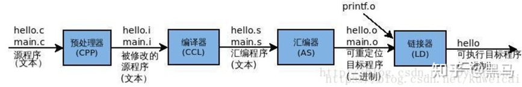

### 内存分配

#### 1、全局(静态)存储区分为三段:data、bss、rodata段。存储在静态数据区的变量会在程序刚开始运行时就完成初始化，也是唯一的一次初始化。
- (1)data段(全局初始化区): 用来存放程序中已初始化(不等于0)的全局变量的内存区域，属于静态内存分配。静态常量和全局变量。
- (2)bss段(全局未初始化区):用来存放程序中未初始化(初始化等于0)的全局变量的内存区域。**存放未初始化的全局变量和静态变量**，区别初始化和非初始化是为了空间效率。未初始化变量不占据实际内存空间(bss变量只在段表中记录大小，在符号表中记录符号。当文件加载运行时，才分配空间以及初始化)，bss段在程序执行之前会被系统自动清0，所以未初始化的全局变量和静态变量在程序执行之前已经为0。(也正是因为反正在bss上的变量肯定都是0，所以不需要为他们分配空间）。
- (3)rodata 段(只读): 常量区，用于存放各类常量，如：const、字面量、#define。
#### 2、静态存储区还包括代码区(text)
- 包括只读存储区和文本区，其中只读存储区存储字符串常量，就是**常量区**，文本区存储程序的机器代码。
#### 3、动态存储区（又分为栈区和堆区）
- 栈区(地址: 从高到低): 就是那些由编译器在需要的时候分配，在不需要的时候自动清除的变量的存储区。里面的变量通常是函数的返回地址、参数、局部变量、返回值等，从高地址向低地址增长。在一个进程中，位于用户虚拟地址空间顶部的是用户栈，编译器用它来实现函数的调用。其操作方式类似于数据结构中的栈。包括局部变量和函数调用的上下文等。栈的大小是固定的，一般是8MB。当然系统也提供了参数，以便我们自定义大小; 
- 堆区(地址: 从低到高): 一般由程序员分配释放，若程序员不释放，程序结束时可能由OS回收 。注意它与数据结构中的堆是两回事，分配方式倒是类似于链表，在程序运行过程中可以动态增加堆大小(移动break指针)，从低地址向高地址增长。
- 文件映射段: 包括动态库、共享内存等，从低地址开始向上增长（跟硬件和内核版本有关。

### 编译链接的过程
#### 程序编译的过程中就是将用户的文本形式的源代码(c/c++)转化成计算机可以直接执行的机器代码的过程。主要经过四个过程：预处理（预编译）、编译、汇编和链接。
- 具体示例如下。
```
#include <stdio.h>
int main()
{
    printf("happy new year!\n");
    return 0;
}
```
- 其编译过程如下：

#### 1、预编译
- C++编译过程的第一个阶段，它在实际编译之前对源代码进行一些文本替换和处理。通常执行以下主要任务：
- (1)、包含文件(Include Files): 通过#include指令。
- (2)、宏替换(Macro Replacement): 预处理器会替换源代码中的宏定义，例如使用#define关键字定义的宏。
- (3)条件编译（Conditional Compilation）：通过#if、#ifdef、#ifndef等指令，你可以根据条件选择性地编译或排除代码块。
- (4)移除注释（Removing Comments）：预处理器会删除源代码中的注释，包括单行注释。
- (5)、其他指令（Other Directives）：预处理器还可以处理其他指令，如#pragma、#error等，用于控制编译器的行为或产生编译错误。
#### 2、编译(compilation)
- C++源代码（.cpp文件）首先被传递给C++编译器（如g++、clang++等）。
- 编译器会进行词法分析和语法分析，检查代码的语法和语义错误。
- 编译器生成一个汇编语言代码文件（通常以.s或.asm为扩展名）。
#### 3、汇编(Assembly)
- 汇编阶段将生成的汇编代码文件传递给汇编器（如GNU Assembler - as）。
- 汇编器将汇编代码翻译成机器代码，这是计算机可以直接执行的指令。
- 汇编器产生一个目标文件（通常以.o、.obj或其他扩展名为扩展名），这个文件包含了程序的机器代码表示。
#### 4、链接(Linking)
- 链接阶段将目标文件与其他库文件（如标准库）链接在一起，以创建最终的可执行文件。
- 链接器（如GNU ld）将目标文件与所需的库文件进行合并，解析符号引用（例如函数和全局变量），并创建一个可执行文件。
- 最终生成的可执行文件通常没有特定的扩展名，而是可以直接运行的程序。


### C++中类成员的访问权限
#### Public
- 使用public标签指定的成员可以被任何访问该类对象的代码访问。
- 公开成员定义了类的外部接口。
#### Protected
- 使用protected标签指定的成员只能被以下几种代码访问：
- 类本身内部的成员函数。
- 继承自该类的派生类中的成员函数。
- 保护成员通常用于在基类和派生类之间共享数据或行为，同时对类的其他使用者隐藏这些细节。
#### Private:
- 使用private标签指定的成员只能被类本身内部的成员函数（以及其友元）访问。
- 私有成员是实现类内部封装的关键，防止了对类实现细节的外部访问。


### 工厂模式
- 鞋厂可以指定生产耐克、阿迪达斯和李宁牌子的鞋子。哪个鞋炒的火爆，老板就生产哪个，看形势生产。
- 1. 工厂类：工厂模式的核心类，会定义一个用于创建指定的具体实例对象的接口。
- 2. 抽象产品类：是具体产品类的继承的父类或实现的接口。
- 3. 具体产品类：工厂类所创建的对象就是此具体产品实例。

### 智能指针
#### std::shared_ptr
#### shared_ptr 的初始化
- shared_ptr是指多个智能指针可以同时管理同一块有效的内存，shared_ptr 是一个模板类，如果要进行初始化有三种方式：通过构造函数、std::make_shared 辅助函数以及 reset 方法。
- shared_ptr对象初始化完毕之后就指向了要管理的那块堆内存，如果想要查看当前有多少个智能指针同时管理着这块内存可以使用共享智能指针提供的一个成员函数 use_count，函数原型如下：
```
// shared_ptr<T> 类模板中，提供了多种实用的构造函数, 语法格式如下:
std::shared_ptr<T> 智能指针名字(创建堆内存);
// 使用智能指针管理一块 int 型的堆内存
shared_ptr<int> ptr1(new int(520));
```
- 通过拷贝和移动构造函数初始化
```
// 使用智能指针管理一块int型的堆内存, 内部引用计数为 1
shared_ptr<int> ptr1(new int(520));
cout << "ptr1管理的内存引用计数:" << ptr1.use_count() << endl;
//调用拷贝构造函数
shared_ptr<int> ptr2(ptr1);
//调用移动构造函数
shared_ptr<int> ptr4(std::move(ptr1));
 ```
- 通过 std::make_shared 初始化
```
shared_ptr<int> ptr1 = make_shared<int>(520);
```
- shared_ptr引用计数在堆上分存放。


#### std::unique_ptr
- std::unique_ptr 是一个独占型的智能指针，它不允许其他的智能指针共享其内部的指针，可以通过它的构造函数初始化一个独占智能指针对象，但是不允许通过赋值将一个 unique_ptr 赋值给另一个 unique_ptr。
```
// 通过构造函数初始化对象
unique_ptr<int> ptr1(new int(10));
// error, 不允许将一个unique_ptr赋值给另一个unique_ptr
unique_ptr<int> ptr2 = ptr1;

std::unique_ptr 不允许复制，但是可以通过函数返回给其他的 std::unique_ptr，还可以通过 std::move 来转译给其他的 std::unique_ptr，这样原始指针的所有权就被转移了，这个原始指针还是被独占的。

// 通过转移所有权的方式初始化
unique_ptr<int> ptr2 = move(ptr1);
```