- https://www.yuque.com/wukong-zorrm/xwas40
## docker
- 快速构建、运行、管理应用的工具
- 传统安装部署:查看版本，卸载旧的，安装新的（安装依赖）
### docker安装
- 卸载旧版本
```
sudo yum remove docker \
                  docker-client \
                  docker-client-latest \
                  docker-common \
                  docker-latest \
                  docker-latest-logrotate \
                  docker-logrotate \
                  docker-engine
```
- Step 1: 安装必要的一些系统工具。``` sudo yum install -y yum-utils device-mapper-persistent-data lvm2``` 
- Step 2: 添加软件源信息。``` sudo yum-config-manager --add-repo https://mirrors.aliyun.com/docker-ce/linux/centos/docker-ce.repo``` 
- Step 3：设置yum源。 ``` sudo sed -i 's+download.docker.com+mirrors.aliyun.com/docker-ce+' /etc/yum.repos.d/docker-ce.repo``` 
- Step 4: 更新Docker-CE。``` sudo yum makecache fast``` 
- Step 5: 安装Docker-CE ``` sudo yum -y install docker-ce``` 
- 配置yum库，``` sudo yum install -y yum-utils```
- Step 6: 启动Docker服务。``` sudo systemctl start docker``` 
- Step 7: 查看Docker服务运行状态，Active显示为：active(running) 表示Docker服务运行正常。``` sudo systemctl status docker``` 
- Step 8: 设置Docker服务开机自启动。``` sudo systemctl enable docker``` 

### Mariadb数据库
- step 1: yum安装Mariadb数据库。``` yum -y install mariadb mariadb-server``` 

- step 2: 启动Mariadb数据库。``` systemctl start mariadb``` 

- step 3：初始化Mariadb数据库，并设置root账号密码为Admin@123。提示：密码在输入时不显示为正常现象，请放心操作。``` mysql_secure_installation``` 。

- 添加yum源：
- ``` yum-config-manager --add-repo http://download.docker.com/linux/centos/docker-ce.repo``` 
- （阿里仓库）：``` yum-config-manager --add-repo http://mirrors.aliyun.com/docker-ce/linux/centos/docker-ce.repo``` 
- 安装docker,  ```sudo yum install docker-ce docker-ce-cli containerd.io docker-buildx-plugin docker-compose-plugin```
- 启动和校验
- 启动docker, ```sudo systemctl start docker```
- 停止dockor, ```sudo systemctl stop dotker```
- 重启, ```sudo systemctl restart docker```
- 设置开机启动, ```sudo systemctl enable docker```
- 执行```docker ps```命令，如果不版情，说明启动成功，```docker ps``` 查看运行的镜像，```docker ps -a``` 所有的镜像

### mysql部署
- ```sudo docker pull mysql:5.7```
- ```sudo docker run -d --name mysql -p 3306:3306 -e TZ=Asia/Shanghai -e MYSQL_ROOT_PASSWORD=123456 mysql:5.7```
- ```docker run```: 创建并运行一个容器
- ```-d```是让容器在后台运行
- ```--name mysql```: 给容器起个名字，必须唯一
- ```-p 3306:3306```: 设置端口映射，宿主机端口映射到容器内端口
- ```-e KEY=VALUE```: 设置环境变量
- ```mysql```:指定运行的镜像的名字，镜像名:版本号
- 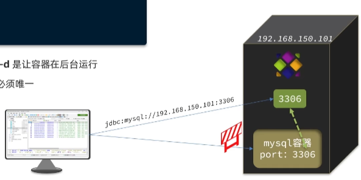

#### docker run和docker start
- ```docker run``` 只在第一次运行时使用，将镜像放到容器中，以后再次启动这个容器时，只需要使用命令docker start 即可。
- docker run 相当于执行了两步操作：将镜像放入容器中（docker create）,然后将容器启动，使之变成运行时容器（docker start）。
- ```docker start```的作用是，重新启动已存在的镜像。也就是说，如果使用这个命令，我们必须事先知道这个容器的ID，或者这个容器的名字，我们可以使用docker ps 找到这个容器的信息。
 
### 镜像和容器
- 当我们利用Docker安装应用时，Docker会自动搜索并下载应用镜像(image)。镜像不仅包含应用本身，还包含应用运行所需要的环境、配置、系统函数库。Docker会在运行镜像时创建一个隔离环境，称为容器(container)。
- 镜像仓库:存储和管理镜像的平台，Docker官方维护了一个公共仓库:DockerHub。
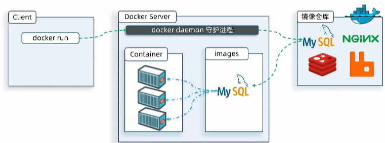
- 镜像都是最小化的系统环境。
- **镜像是一个静态的、可重复使用的软件包，而容器是运行时实例（容器针对于同一个镜像可以有多个），是基于镜像创建的、可执行的进程。多个容器可以共享同一个镜像，但每个容器都是独立运行的实例。容器提供了隔离和轻量级的虚拟化，使应用程序在不同环境中具有一致的运行行为。** 删除镜像的话，需要删除其容器。首先查看docker ps -a，然后删除 docker rm 容器，最后 docker iamges 镜像。

### docker 常用命令  
- 官网参考，https://docs.docker.com/engine/reference/commandline/container_exec/

- docker run是创建并运行一个容器，docker start 运行容器，docker stop 暂停容器运行。

### 查看DockerHub，拉取Nginx镜像，创建并运行Nginx容器
#### 需求:
- 在DockerHub中搜索Nginx镜像，查看镜像的名称 
- 拉取Nginx镜像 ```docker pull nginx:1.22```
- 查看本地镜像列表 ```docker images```
- 创建并运行Nginx容器  ```sudo docker run -d --name nginx -p 8080:80 nginx:1.22``` 也可以在创建并运行一个```sudo docker run -d --name nginx2 -p 8081:80 nginx:1.22``` 注意宿主机端口改变和名称改变
- 查看容器            ```docker ps```
- 停止容器            ```docker stop nginx:1.22```
- 再次启动容器        ```docker start nginx:1.22```
- 进入Nginx容器       ```docker exec -it  nginx:1.22 bash```, ```-it```是使用交互模式，可以在控制台里输入、输出
- 删除容器            ```docker rm nginx```
- 删除容器2           ```docker rm nginx2```
- 删除镜像            ```docker rmi nginx```
- 日志监控镜像         ```docker logs -f nginx```, 其中```-f```是一直监控

### 基于数据卷的挂载
#### 数据卷(volume)是一个虚拟目录，是容器内目录与宿主机目录之间映射的桥梁（双向绑定，修改任一方，另一方随之变化）。
- 容器内的文件会映射到宿主机，非常方便的修改容器内的文件，或者方便迁移容器内产生的数据。
- 以nginx为例，容器内的路径为/usr/share/nginx/html
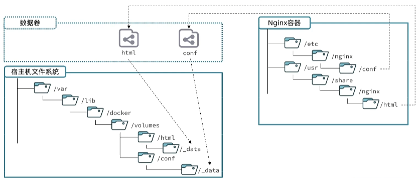
- ```docker volume create```   创建数据卷   
- ```docker volume ls```       查看所有数据卷
- ```docker volume rm```       删除指定数据卷
- ```docker volume inspect```  查看某个数据卷的详情，包括在宿主机内的路径
- ```docker volume prune```    清除数据卷
- 通过```docker volume --help``` 查看有关命令的信息
#### 案例1-利用Nginx容器部署静态资源
##### 需求:
- 创建Nginx容器，修改nginx容器内的html目录下的index.html文件，查看变化将静态资源部署到nginx的html目录。
- 在执行docker run命令时，使用```-v数据卷:容器内目录 ```可以完成数据卷挂载
- 当创建容器时，如果挂载了数据卷且数据卷不存在，会**自动创建数据卷**
- ```docker run -d -name nginx -p 80:80 -v html:/usr/share/nginx/html nginx:1.22```
- ```-v``` 为数据卷参数 数据卷名称（可以改变，唯一）:容器内目录（根据业务需求去找，是固定的，比如nginx容器内的位置为/usr/share/nginx/html）

### 基于本地目录的挂载
#### 案例2-mysql容器的数据挂载
##### 需求:
- 查看mysql容器，判断是否有数据卷挂载。
- 基于**宿主机目录**实现MySQL数据目录、**配置文件**、**初始化脚本的挂载**(**查阅官方镜像文档**)。
- 挂载自定的``` /root/mysql/data ``` **数据目录**到容器内指定的 ``` /var/lib/mysql ```目录。```-v /root/mysql/init:/docker-entrypoint-initdb.d```。
- 挂载自定的``` /root/mysql/init``` **初始化脚本**到容器内指定的 ```/docker-entrypoint-initdb.d ```目录。 ``` -v /root/mysql/init:/docker-entrypoint-initdb.d ```。这里可以放一些创建表的sql语句。
- 挂载```/root/mysql/conf```**配置文件**到容器内的```/etc/mysql/conf.d```目录。```-v /root/mysql/conf:/etc/mysql/conf.d```。
- 以上3个本地目录先在本地创建。
```docker run -d --name mysql -p 3308:3306 -e TZ=Asia/Shanghai -e MYSQL_ROOT_PASSWORD=123456 -v /root/mysql/data:/var/lib/mysql -v /root/mysql/init:/docker-entrypoint-initdb.d -v /root/mysql/conf:/etc/mysql/conf.d mysql:5.7 ```。

- conf目录下的hm.cnf配置文件:
```
[client]
default_character_set=utf8mb4
[mysql]
default_character_set=utf8mb4
[mysqld]
character_set_server=utf8mb4
collation_server=utf8mb4_unicode_ci
init_connect='SET NAMES utf8mb4'
```
##### 为什么要进行基于本地目录的挂载
- mysql 随着数据库数据的增长，mysql把数据存储目录挂载到宿主机，保证数据的解耦合，一般是通过默认的**匿名卷**（名字很长的随机生成的一大串）。如果需要对mysql容器版本进行升级，也就是需要先把旧的容器删除（```docker rm -f some-mysql```），但是数据卷依旧存在（```docker volume ls```, 需要命令```docker volume rm XX``` 才可以对数据卷进行删除，这里没必要，因为只是mysql容器的版本需要更新，数据卷不需要删除，而且要完成迁移），数据依然在。当生成新的容器版本时，生成的数据卷名称发生过变化（因为是随机生成的），原来的数据存在旧的数据卷里面，无法没有完成数据的迁移（可以进入旧的数据卷里面，把数据拷贝出来，不建议使用**匿名卷**），这里就可以进行基于本地目录的挂载，任何一个本地目录。

#####  注意
- 在执行docker run命令时，使用```-v 本地目录:容器内目录```可以完成本地目录挂载。
- 本地目录必须以```"/"```或```"./"```开头，如果直接以名称开头，会被识别为数据卷而非本地目录。
- 例：```-v mysql:/var/lib/mysql```被识别为一个数据卷叫mysql。
- 例：```-v ./mysql:/var/lib/mysql```被识别为当前目录下的mysql目录。

##### 远程连接docker的mysql
- 需要授权, 添加远程登录用户
- https://blog.csdn.net/jin_tmac/article/details/124627780
- ```CREATE USER 'zhj'@'%' IDENTIFIED WITH mysql_native_password BY '123456';```
- ```GRANT ALL PRIVILEGES ON *.* TO 'zhj'@'%';```
- https://blog.csdn.net/weixin_43049705/article/details/119843679

### Docker 语法

#### 自定义镜像
- 镜像就是包含了应用程序、程序运行的系统函数库、运行配置等文件的文件包。构建镜像的过程其实就是把上述文件打包的过程。
#### 部署一个ava应用的步骤:
- 准备一个Linux服务器。
- 安装JRE并配置环境变量。
- 拷贝jar包。
- 运行Jar包。
#### 构建一个java镜像的步骤:
- 准备一个Linux运行环境
- 安装JRE并配置环境变量
- 拷贝jar包
- 编写运行脚本
#### 镜像结构
##### 入口(Entrypoint)
- 镜像运行入口，一般是程序启动的脚本和参数。
##### 层(Layer)
- 添加安装包、依赖、配置等，每次操作都形成新的一层。
##### 基础镜像(BaseImage)
- 应用依赖的系统函数库、环境、配置、文件等
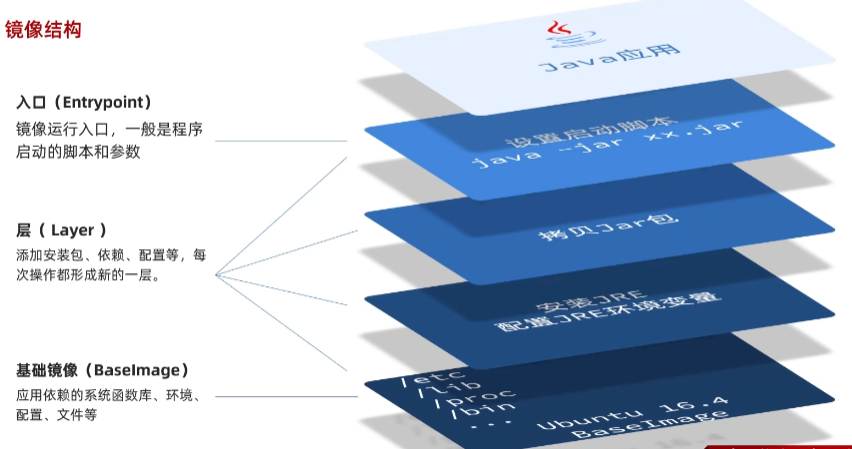

#### dockerfile
- Dockerfile就是利用固定的指令来描述镜像的结构和构建过程，这样Docker才可以依次来构建镜像。
- Dockerfile就是一个文本文件，其中包含一个个的指令(Instruction)，用指令来说明要执行什么操作来构建镜像。将来Docker可以根据Dockerfile帮我们构建镜像。
- 常见指令如下: 
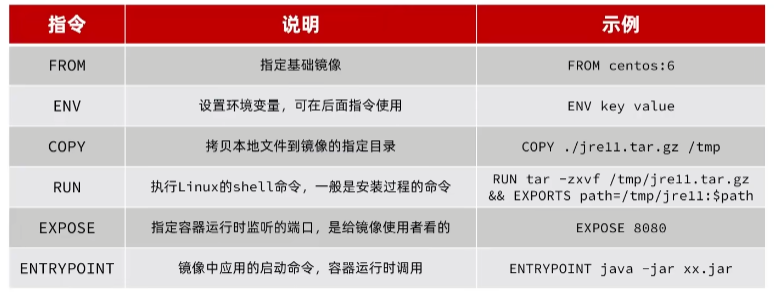
- 指令参考: https://docs.docker.com/engine/reference/builder/

- 我们可以基于Ubuntu基础镜像，利用Dockerfile描述镜像结构
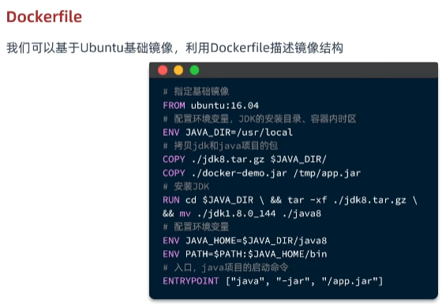
- 也可以直接基于JDK为基础镜像，省略前面的步骤
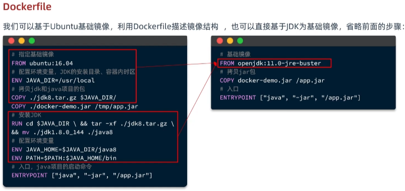

#### 当编写好了Dockerfile，可以利用下面命令来构建镜像:
- ```docker build -t myImage:1.0 . ```
- ```-t``` 是给镜像起名，格式依然是```repository:tag```的格式，不指定```tag```时，默认为```latest```。
- ```.``` 是指定Dockerfile所在目录，如果就在当前目录则指定为```.```。
- 加载镜像``` docker load -i jdk.tar ```。
- 通过``` docker images ``` 查看。

- 进入demo目录，基于Dockerfile文件构建镜像 ```docker build -t docker-demo1 . ```。 ```docker build -t 镜像名 Dockerfile目录```。
- 通过``` docker images ``` 查看镜像docker-demo1。
- 运行镜像``` docker run -d --name dd -p  8083:8080 docker-demo1 ``` 端口是宿主机8083映射到容器内8080，容器命名dd。
- 查看容器日志 ``` docker logs -f dd```。

##### 其中Dockerfile文件文件如下：
```
# 基础镜像
FROM openjdk:11.0-jre-buster
# 设定时区
ENV TZ=Asia/Shanghai
RUN ln -snf /usr/share/zoneinfo/$TZ /etc/localtime && echo $TZ > /etc/timezone
# 拷贝jar包
COPY docker-demo.jar /app.jar
# 入口
ENTRYPOINT ["java", "-jar", "/app.jar"][root@localhost demo]#
```
## docker 容器网络互连
#### 网络
- 默认情况下，所有容器都是以bridge方式连接到Docker的一个虚拟网桥上，如下:
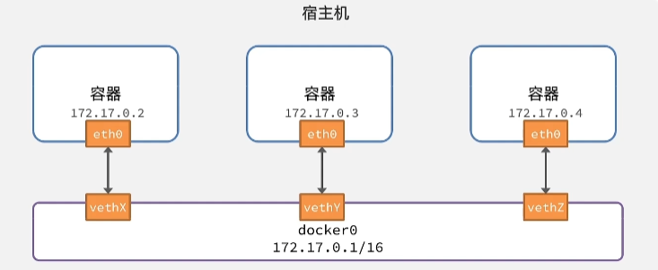
- 这时候的容器ip是可能随时变化的，因为每次重新启动的时候，有别的容器也在启动的话，ip是递增的。但是每次重启，容器名是不变的。

#### 自定义网络
- 加入自定义网络的容器才可以通过容器名互相访问，Docker的网络操作命令如下:
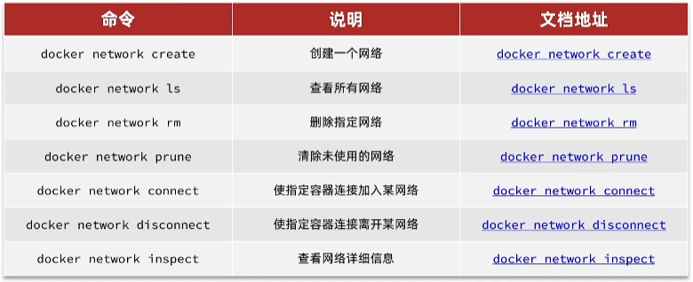
- 通过```ip addr ```显示网络情况。
- ``` docker network --help```
- 查看所有网络 ``` docker network ls ```。
- 创建网络 ``` docker network create mynetwok```。
-  查看网络 ```ip addr ```如下：
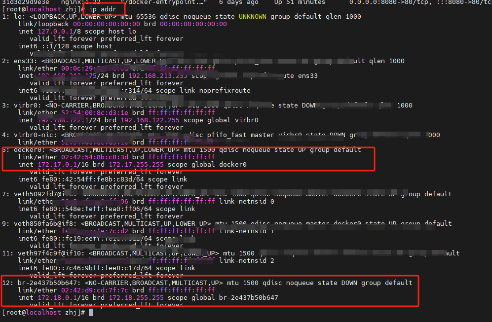
- 将容器加入网络，``` docker network connect mynetwork dd ```。
- 查看容器信息 ``` docker inspect dd```。除了默认的网络bridge信息，还有新的mynetwork信息。
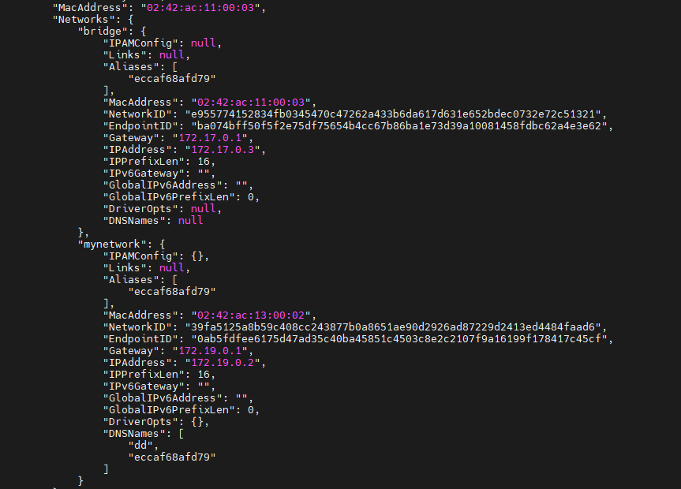

- 指定容器dd离开默认的bridge网络``` docker network disconnect bridge dd``` 
- 查看容器信息 ``` docker inspect dd```，如下：
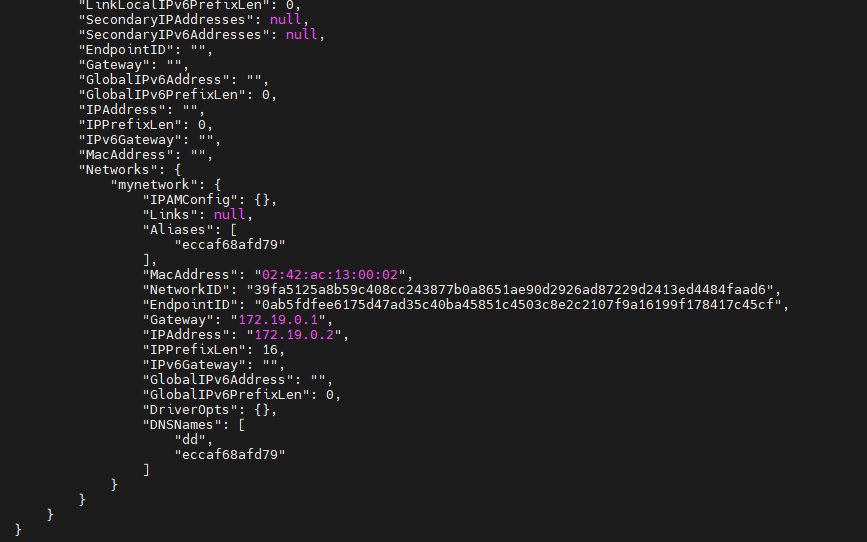
- 也可以在创建容器的时候指定网络信息。``` docker run -d--name dd -p 8083:8080 --network mynetwork docker-demo ```。

##### docker network prune 用于清理不再使用的网络，而 docker network rm 用于明确删除指定的网络。

## 项目部署 - 部署java应用
- idea工具直接打包
- 将Dockerfile文件和打包完成的jar包复制到root目录下。
- 其中Dockerfile文件如下:
```
# 基础镜像
FROM openjdk:11.0-jre-buster
# 设定时区
ENV TZ=Asia/Shanghai
RUN ln -snf /usr/share/zoneinfo/$TZ /etc/localtime && echo $TZ > /etc/timezone
# 拷贝jar包
COPY hm-service.jar /app.jar
# 入口
ENTRYPOINT ["java", "-jar", "/app.jar"]
``` 
- root目录下构建镜像```docker build -t hmall . ```
- 运行镜像,并给容器命名hm```docker run -d --name hmall -p 8083:8080 --network mynetwork hmall ```

- 查看容器日志```docker logs -f hmall```
- 注意打包的连接mysql数据端口信息和部署的mysql信息一致.
- 如下: 
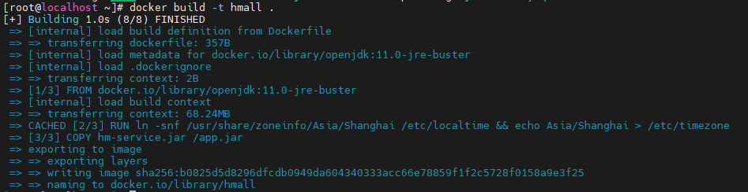

## 项目部署 - 部署前端(nginx文件)
#### 需求:创建一个新的nginx容器，将nginx.conf、html目录与容器挂载
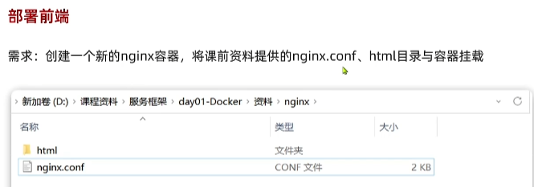

- 实现对nginx进行配置,hmall-portal是商城前端界面,hmall-admin是商城后台管理界面,nginx对这两个界面分别进行代理.
- 访问通过容器名进行访问,java应用和mysql互连.java应用,mysql, nginx在一个网络内.
- ```docker run -d --name mynginx -p 18080:18080 -p 18081:18081 -v/root/nginx/html:/usr/share/nginx/html -v /root/nginx/nginx.conf:/etc/nginx/nginx.conf --network mynetwork nginx:1.22```

##### 安装多个版本jdk，可自由切换 
- 这里需要jdk11版本。
- https://blog.csdn.net/zdl177/article/details/105246997

## 项目部署 - DockerCompose
- Docker Compose通过一个单独的docker-compose.yml模板文件(YAML格式)来定义一组相关联的应用容器，帮助我们实现多个相互关联的Docker容器的快速部署。
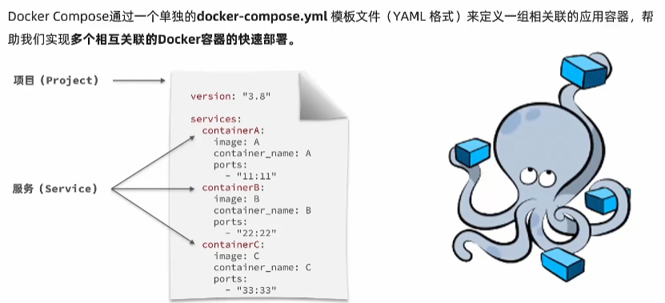

#### docker-compose.yml文件如下:
```
version: "3.8"

services:
  mysql:
    image: mysql
    container_name: mysql
    ports:
      - "3306:3306"
    environment:
      TZ: Asia/Shanghai
      MYSQL_ROOT_PASSWORD: 123456
    volumes:
      - "./mysql/conf:/etc/mysql/conf.d"
      - "./mysql/data:/var/lib/mysql"
      - "./mysql/init:/docker-entrypoint-initdb.d"
    networks:
      - hm-net
  hmall:
    build: 
      context: .
      dockerfile: Dockerfile
    container_name: hm
    ports:
      - "8080:8080"
    networks:
      - hm-net
    depends_on:
      - mysql
  nginx:
    image: nginx
    container_name: nginx
    ports:
      - "18080:18080"
      - "18081:18081"
    volumes:
      - "./nginx/nginx.conf:/etc/nginx/nginx.conf"
      - "./nginx/html:/usr/share/nginx/html"
    depends_on:
      - hmall
    networks:
      - hm-net
networks:
  hm-net:
    name: hmall
```
- docker run命令和dockerCompose.yml的区别,语法不一样.dockerCompose.yml完成需参考docker run命令,两者对比如下: 
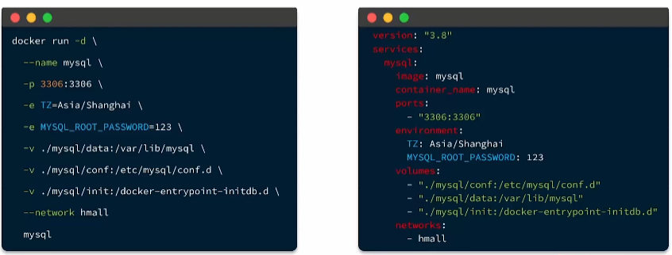
#### docker compose的命令格式如下:
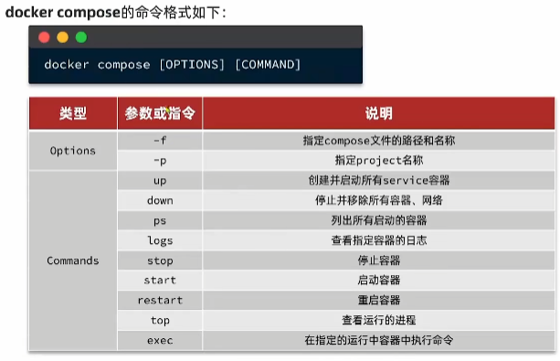
- 先清楚之前存在的容器.
- 运行命令```docker compose up -d``` ,```-d```还是后台运行.
- ```docker compose ps``` 查看项目下的所有进程
- ```docker compose down``` 清除所有容器和网络.
##### dockercompose还可以完成集群的部署,先实现多服务器的互连,然后集群部署(可以设置负载均衡).

## 容器集群的必要性
##### 单个容器的应用可以满足简单应用场景或者少量用户访问，但随着应用越来越复杂、访问量越来越大，单个容器的性能慢慢不支，就需要不断增加更多容器来提高应用的处理能力。但随着容器越来越多，就引发了一系列问题：
- 如何跨主机部署成百上千个容器？
- 如何协调和调度大量的容器？
- 如何在升级应用程序时不会中断服务？
- 如何监视应用程序的运行状况？
##### 由于容器本质上是轻量级且短暂存在的，因此在生产环境中运行和管理大量容器，所需工作量巨大。遇到业务访问量特别大的时候，可能需要同时运行数百甚至数千个容器。如果手动管理这些容器，会显著增加管理复杂性。
##### 所以，当大规模使用容器时，人工管理已经不可行，不得不考虑容器调度、部署、跨节点访问、自动伸缩等问题，这就需要容器集群技术了。

## 容器编排
##### 容器编排是指自动化容器的部署、管理、扩展和联网。通过容器编排，可以构建跨多个容器的应用服务、跨集群调度容器、扩展这些容器，并持续管理它们的健康状况。容器编排给容器技术带来了巨大的价值，包括：

- 自动化部署：支持根据副本数量，回滚，重启等策略自动部署容器。
- 服务发现与负载均衡：自动发现增加的容器，并进行流量的负载均衡。
- 自动化容器恢复：自动对容器进行健康检查，并根据策略进行重启。
- 弹性伸缩：支持工作节点、容器的自动扩缩容。
##### 一个容器编排平台的核心功能：首先可以自动生成容器实例，并且生成的容器可以跨服务器的，帮助提高可用性和性能，同时还有健康检查、容错、可扩展、网络、服务发现、滚动升级等功能，可以很好地解决需求与资源的匹配编排问题。

##### 容器编排平台的市场竞争曾经非常激烈，主流的有三个：Docker Swarm、Mesos Marathon和Kubernetes。它们各有特点，但同时满足上面上述能力的，只有**Kubernetes（k8s）**。

##### Kubernetes是一个面向终态的编排系统。用户按照Kubernetes提供的带有编排逻辑的工作负载模版，向Kubernetes声明期望的应用容器的状态，随后Kubernetes会创建对应的工作负载。Kubernetes的调度器一直在监听各种请求，一旦发现创建了对应的应用容器，立马根据计算节点的情况与预定的策略，把容器调度到最适合的计算节点。计算节点也在监听是否有与自己有关的应用容器创建，如果有，立即拉取用户想要的镜像并运行，并向Kubernetes报告应用容器的状态。工作负载的控制器也在不断监听容器集群的状态是否与用户的预期一致，如果不一致，会按照工作负载控制器的编排逻辑进行处理。容器镜像都创建后，计算节点也会自动发现服务并进行业务负载。

### Kubernetes核心概念
##### Kubernetes简称K8s，是Google开源的一个容器编排引擎，它支持自动化部署、大规模可伸缩、应用容器化管理。

##### 为什么需要Kubernetes？容器是打包和运行应用程序的好方式。在生产环境中，往往需要管理运行着应用程序的容器，并确保服务不会下线。如果一个容器发生故障，则需要启动另一个容器，类似这样的行为可以交由Kubernetes 来处理。Kubernetes 会满足用户的扩展要求、故障转移你的应用、提供部署模式等。

##### 对于容器和Kubernetes的关系，为了便于理解，可以做个类比：Kubernetes就好比一个操作系统，而容器就好比操作系统上运行的一个进程。

#####  Kubernetes中涉及到的关键名词包含以下这些，他们重要但很抽象，建议您先记住这些名词和概念，在本课程中我们将结合后续实际操作步骤为您展开介绍。

- **Pod（容器组）**：Pod是一个逻辑概念，是一组紧密关联的容器的集合。
Controller（控制器）：控制器通过控制循环监控集群状态，将当前状态转变为期望状态。控制器包含节点控制器、命名空间控制器、工作负载控制器等多种。
- **Workload（工作负载）**：工作负载是在 Kubernetes 上运行的应用程序，分为无状态、有状态、任务、定时任务等多种类型。
- **Service（服务）**：将运行在一个或一组Pod上的应用程序公开为网络服务的方法，是真实应用服务的抽象。
- **PV、PVC**：PV是存储卷，是集群内的存储资源，PV独立于Pod的生命周期。PVC是存储卷声明，是资源的使用者。Pod挂载PVC，PVC消耗PV资源。
- **Namespace（命名空间）**：命名空间为容器集群提供虚拟的隔离作用。
- **etcd**：etcd是一个分布式、一致且高可用的**键值**存储系统，通常被用作Kubernetes所有集群数据的后台数据库。

## 阿里云容器服务
### 容器服务Serverless版 ACK Serverless
- ACK Serverless是阿里云推出的Serverless版Kubernetes容器服务。用户无需购买节点即可直接部署容器应用，无需对集群进行节点维护和容量规划，根据应用配置的CPU和内存资源量按需付费。ACK Serverless集群提供完善的Kubernetes兼容能力，同时降低了Kubernetes使用门槛，让用户更专注于应用程序，而不是管理底层基础设施。

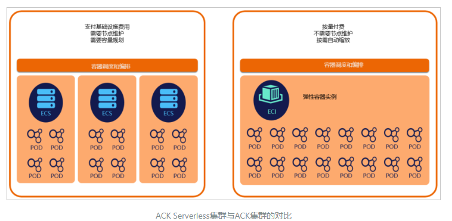
- 集群中的Pod基于弹性容器实例ECI运行在安全隔离的容器运行环境中。

#### 弹性容器实例ECI
- ACK Serverless底层基于弹性容器实例（ECI）来运行Pod，弹性容器实例ECI（Elastic Container Instance）是面向容器的无服务器弹性计算服务， 是跟 云服务器ECS 同级别的计算资源类产品，针对云原生时代的需求进行了针对性的改进和优化。

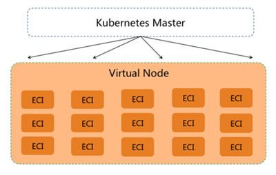

- ECI是面向容器的无服务器弹性计算服务
- ECI提供免运维、强隔离、快速启动的容器运行环境
- 使用ECI无需购买和管理底层ECS服务器，让用户更加关注在容器应用而非底层基础设施的维护工作。

### ACK Serverless主要特点
- 1、虚拟节点：ACK Serverless集群基于虚拟节点创建Pod，虚拟节点实现了Kubernetes与弹性容器实例ECI的无缝连接，让Kubernetes集群获得极大的弹性能力，而不必关心底层计算资源容量。
- 2、安全隔离：ACK Serverless集群中的Pod基于ECI运行在安全隔离的容器运行环境中，底层通过轻量级虚拟化安全沙箱技术完全强隔离，容器实例间互不影响；同时实例在调度时尽可能分布在不同的物理机上，进一步保障了高可用性。
- 3、Pod配置：支持原生的Kubernetes Pod功能，支持执行命令kubectl logs访问容器日志和执行kubectl exec进入容器，ECI支持多种规格配置的方式申请资源和计费。
- 4、应用负载管理：支持Deployment、StatefulSet、Job/CronJob、Pod、CRD等原生Kubernetes负载类型。

### 构建和运行企业网站应用的主要步骤
- 基于ACK Serverless搭建公司网站应用，一共分为三大步骤，分别是：
- **（1）创建ACK Serverless集群和准备资源**；在阿里云控制台创建并生成ACK Serverless集群，然后要准备好部署应用所需要的资源，包括准备好WordPress网站所需的数据库、确定公司网站镜像可用、并准备好存放网站站点目录所需的持久存储(容器集群之外,文件存储NAS)。

- **（2）部署与配置网站应用**；在ACK Serverless集群上部署应用。部署应用时要注意，创建的应用类型是无状态的，还要设置副本数量，副本数量需要根据前期评估的访问量进行设置。1）在ACK Serverless中要如何使用文件存储NAS(首先需要创建PV和PVC，让PV要指向对应的NAS，才能把PVC给到应用集群使用)。2）另外，还要创建服务，并开通负载均衡，让用户可以通过负载均衡访问服务。

- **（3）应用运维与集群管理**。从ACK Serverless控制台，熟悉并查看集群、无状态、容器组、服务等信息，查看容器日志，管理集群，还可以设置相应的监控和告警。

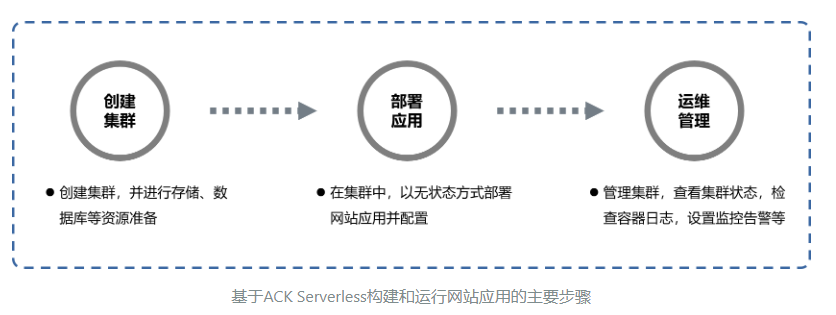

### 一、创建ACK Serverless集群
#### 1、创建ACK Serverless集群
- 在这里我们可以看到阿里云容器服务ACK的不同版本，本次任务我们选择ACK Serverless集群进行资源创建。
#### 2、配置组件（本次任务暂且不涉及），直接创建生成集群。
##### 容器集群的管理节点
- Kubernetes是由控制平面的一个或多个管理节点（Master Node）和计算平面的多个工作节点（Worker Node）组成的。那么，刚创建的ACK Serverless集群对应多个管理节点组成的控制平面。一个管理节点包含四个主要组件：API Server、Controller Manager、Scheduler 及 etcd，他们之间存在一定的协作关系。

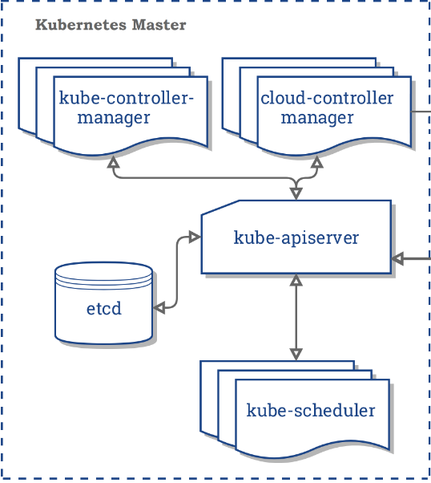

- **API Server**：Kubernetes集群的统一服务入口，负责资源的认证、鉴权以及CRUD（增删改查）等操作，提供Restful API接口，提供其他模块之间数据交互和通信的枢纽，API Server接收客户端发起的控制资源对象的API请求，将期望状态存储到etcd中。
- **Controller Manager**：所有资源对象的自动化控制中心，完成对集群内Node、Pod、Service等资源状态的管理，确保集群始终处于预期的工作状态；
- **Scheduler**：Pod资源对象的调度服务。将待调度的 Pod 按照一定的调度算法和策略绑定到合适的Node节点上，并将绑定信息写入到 etcd 中；
- **etcd**：是一个分布式的存储系统，所有Kubernetes资源对象的数据，都放置在 etcd 中，etcd 本身是一个高可用系统。

### 二、准备资源
#### 3、准备公司网站WordPress的应用镜像；
- 提前构建好WordPress网站应用的镜像，并上传到镜像服务ACR中。现在直接基于镜像部署应用，选择位于ACR仓库中的WordPress网站应用镜像。
- ACR是阿里云容器镜像服务，可以用于镜像的托管和全生命流程管理。

#### 4、创建用于存放公司网站WordPress站点目录的NAS；
- 通过文件存储NAS的控制台，选择通用型NAS，配置NAS的协议类型NFS等参数，完成创建。

- NAS创建完成后，记录其挂载点地址，后续ACK Serverless存储卷的挂载点将使用该地址。

#### 5、创建用于保存企业网站WordPress结构化数据的云数据库MySQL；
- WordPress网站的数据库独立于ACK Serverless集群，由于公司网站业务的访问存在明显的波动特征，为了让数据库也能匹配业务波动，我们选择了免运维、计算资源能自动弹性扩缩容的RDS MySQL Serverless实例。


## docker的技术特点：
- 容器是自包含的。它打包了应用程序及其所有依赖，可以直接运行。
- 容器是可移植的。可以在几乎任何地方以相同的方式运行。这就可以确保应用在开发环境、测试环境、生产环境等都有完全一样的运行环境。
- 容器是轻量级的。占用资源很少，可以秒级启动。
- 容器是互相隔离的。同一主机上运行的多个容器，不会互相影响。


## Docker和虚拟机的不同
#### 1、启动速度不同
- docker：启动 docker 相当于启动宿主操作系统上的一个进程，启动速度属于秒级别。
- 虚拟机：启动虚拟机需要先启动虚拟机的操作系统，再启动应用，这个过程非常慢，通常需要几分钟。

#### 2、占用资源不同
- docker：docker 只是一个进程，只需要将应用以及相关的组件打包，在运行时占用很少的资源，一台机器可以开启成千上万个 docker。容器运行时，与宿主机共享操作系统内核，容器在linux内核层面 (使用 **Cgroups** 和 **namespaces**) 来实现进程间的隔离。
- 虚拟机：虚拟机是一个完整的操作系统，需要占用大量的磁盘、内存和 CPU 资源，一台机器只能开启几十个的虚拟机。

#### 3、隔离性不同
- docker：docker隔离性更弱，docker属于进程之间的隔离。
- 虚拟机：虚拟机隔离性更强，可实现系统级别隔离。

#### 4、安全性不同
- docker：docker的安全性更弱。Docker的租户root和宿主机root等同，一旦容器内的用户从普通用户权限提升为root权限，它就直接具备了宿主机的root权限，进而可进行无限制的操作，容器至今还没有任何形式的硬件隔离，这使得容器容易受到攻击。
- 虚拟机：虚拟机租户root权限和宿主机的root虚拟机权限是分离的，并且虚拟机利用如Intel的VT-d和VT-x的ring-1硬件隔离技术，这种隔离技术可以防止虚拟机突破和彼此交互。

#### 5、可管理性不同
- docker：docker的集中化管理⼯具还不算成熟。
- 虚拟机：各种虚拟化技术都有成熟的管理工具，例如VMware vCenter提供完备的虚拟机管理能⼒。

#### 6、高可用和可恢复性
- docker：docker对业务的高可用支持是通过快速重新部署实现的。
- 虚拟机：虚拟化具备负载均衡，高可用，容错，迁移和数据保护等经过⽣产实践检验的成熟保障机制，VMware可承诺虚拟机99.999%高可用，保证业务连续性。

#### 7、创建、删除速度不同
- docker：Docker容器创建是秒级别的，Docker的快速迭代性，决定了⽆论是开发、测试、部署都可以节约⼤量时间。
- 虚拟机：虚拟化创建是分钟级别的。

#### 8、交付部署不同
- docker：Docker在Dockerfile中记录了容器构建过程，可在集群中实现快速分发和快速部署。
- 虚拟机：虚拟机可以通过镜像实现环境交付的⼀致性，但镜像分发⽆法体系化。

## Docker
##### Docker是一个开源的应用容器引擎，由于docker影响巨大，今天也用“Docker”指代容器化技术。

### Docker优势
#### 一键部署，开箱即用
- 容器使用基于image镜像的部署模式，image中包含了运行应用程序所需的一切: 代码运行时、系统工具、系统库和配置文件。无论是单个程序还是多个程序组成的复杂服务，或者分布式系统，都可以使用 ```docker run``` 或 ```docker compose up``` 命令一键部署，省去了大量搭建、配置环境、调试和排查错误的时间。
#### 一次打包，到处运行
- Docker 为容器创建了行业标准，使容器成为了软件交付过程中的一种标准化格式，将软打包成容器镜(image)，能够使软件在不同环境下运行一致，应用程序可以快速可靠地从一个环境移植到另外一个环境，并确保在所有的部署目标 (例如开发、测试、生产环境)上都按预期运行，从而避免了"在我电脑上是好的，怎么到你那却不能用了?"的问题。

### Docker安装
#### 安装环境: CentOS7.3+
- 如果之前安装了旧版docker，请先删除
- ```sudo yum remove docker ocker-client docker-client-latest docker-common docker-latest docker-latest-logrotate docker-logrotate docker-engine```

#### 安装仓库
- ```sudo yum install -y yum-utils```
- 添加源 ```sudo yum-config-manager --add-repo https://download.docker.com/linux/centos/docker-ce.repo```

#### 安装Docker
- ```sudo yum install docker-ce docker-ce-cli containerd.io docker-compose-plugin```

#### 启动docker
- ```sudo systemctl start  docker```
- ```sudo docker run hello-word```


#### 配置国内镜像
- 配置文件在```/etc/docker```，新建daemon.json
- ```{```
```"registry-mirrors":[```
```"https://registry.docker-cn.com",```
```"http://hub-mirror.c.163.com",```
```"https://fsp2sfpr.mirror.aliyuncs.com/"]```
```}```
#### 然后重启，配置开机启动
- ```sudo system&tl restart docker```
- ```sudo systemctl enable docker``` //docker开机启动
- ```sudo systemctl enable containerd```//containerd开机启动

### docker pull 命令
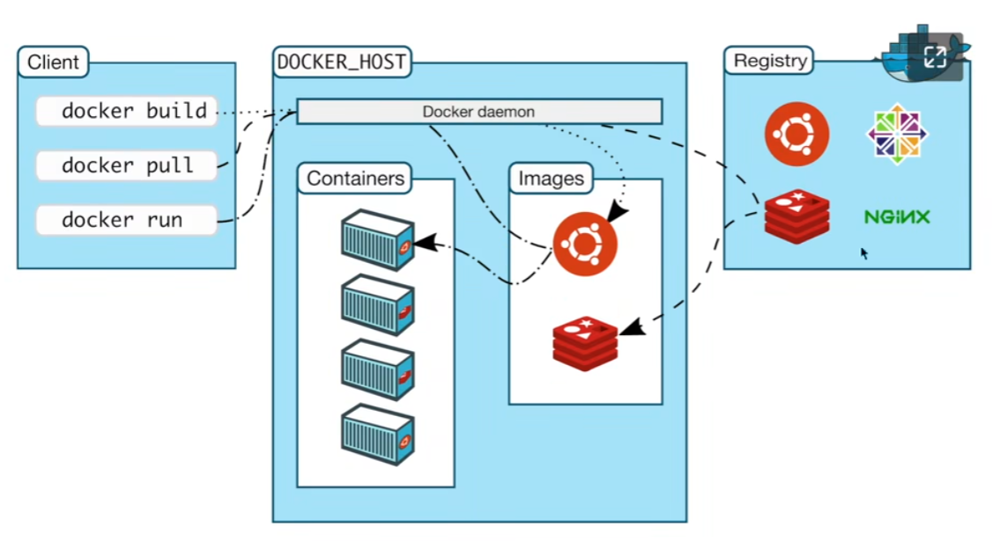
- 运行镜像可以产生容器
- 如:```docker pull nginx:1.22``` //默认为最新版本latest
- 查看本地镜像，```docker images``` 
- 查看运行中的镜像命令，```docker ps``` 
- 查看所有的镜像命令，```docker ps -a ``` 
- 查看启动日志命令，```docker logs 容器名称或者id``` 
- 创建并运行容器 ```docker run -d --name some-nginx -p 8080:80 nginx:1.22```，并给容器指定名称some-nginx。

#### 映射端口(-p)
```docker run -d --name some-nginx -p 8080:80 nginx:1.22```
- some-nginx为容器的名称，-d表示容器在后台运行。-p表示将容器的端口80绑定到宿主机的端口8080。
- 默认情况下，容器无法通过外部网络访问。需要使用-p参数将容器的端口映射到宿主机端口，才可以通过宿主机IP进行访问。浏览器打开 http://ip:8080
- ```docker stop some-nginx```  //停止容器
- ```docker ps -a``` //查看所有的容器
- ```docker rm 容器id或者名称``` //删除容器
- ```-p 8080-8090:8080-8090``` //公开端口范围，前后必须对应
- ```-p 192.168.56.106:8080:80``` //如果宿主机有多个ip，可以指定绑定到哪个ip

#### docker run开箱即用
- ```docker inspect some-mysql（容器名称）``` //查看容器的信息

#### 前台交互运行
- 创建一个新的容器，使用mysql客户端```docker run -it --rm mysql:5.7 mysgl -h172.17.0.2 -uroot -p``` 
- ```-it```使用交互模式，可以在控制台里输入、输出 
- ```--rm```在容器退出时自动删除容器。一般在使用客户端程序时使用此参数如果每次使用客户端都创建一个新的容器，这样将占用大量的系统空间```mysql -h172.17.0.2 -uroot -p``` 表示启动容器时执行的命令。
- 例如: docker run -it --rm mysql:5.7 mysql -h172.17.0.2 -uroot -p 
- ```docker exec```
- 在运行的容器中执行命令，一般配合```-it``` 参数使用交互模式
- ```docker exec -it db-mysql /bin/bash```

### docker 网络（三种+一种自定义）
#### bridge桥接网络
- 如果不指定，新创建的容器默认将连接到bridge网络。默认情况下，使用bridge网络，宿主机可以ping通容器ip，容器中也能ping通宿主机。容器之间只能通过P 地址相互访问，由于容器的ip会随着启动顺序发生变化，因此不推荐使用ip访问。
#### host
慎用，可能会有安全问题
- 容器与宿主机共享网络，不需要映射端口即可通过宿主机IP访问。 (-p选项会被忽略)主机模式网络可用于优化性能，在容器需要处理大量端口的情况下，它不需要网络地址转换 (NAT)，并且不会为每个端口创建“用户空间代理”。
#### none
- 禁用容器中所用网络，在启动容器时使用。
- ```docker ps``` 查看运行的容器
- ```docker inspect --formate='{{range .NetworksSettings.Networks}}{{.IPAddress}{{end}}' 容器名称``` //显示容器ip
- ```curl 172.17.0.3:80``` //在宿主机直接访问80端口
- ```docker exec -it some-nginx /bin/bash``` //进入其中一个容器，进行容器间的ping通信
- docker hub 搜索busybox
- ```docker run -it --rm busybox``` //启动busybox工具
- ```ping 172.17.0.2``` //可以ping
- 以上说明在bridge模式下，容器之间是可以通信的，也可以ping通宿主机。

#### 用户自定义网络
- 创建用户自定义网络
- ```docker network create my-net```
- 将已有容器连接到此网络
- ```dogker network connect my-net some-mysql```
- ```dogker network disconnect my-net some-mysql``` //断开
- 创建容器时指定网络
- ```docker run -it --rm --network my-net mysql:5.7 mysql -hsome-mysql -uroot -p```
- 在用户自定义网络上，容器之间可以通过容器名进行访问，不需要桥接下的ip访问。
- 用户自定义网络使用 Docker 的嵌入式DNS服务器将容器名解析成IP。

### docker 存储
- 将数据存储在容器中，一旦容器被删除，数据也会被删除。同时也会使容器变得越来越大，不方便恢复和迁移。
- 将数据存储到容器之外，这样删除容器也不会丢失数据。一旦容器故障，我们可以重新创建一个容器，将数据挂载到容易里，就可以快速的恢复。
#### 存储方式
- docker提供了以下存储选项
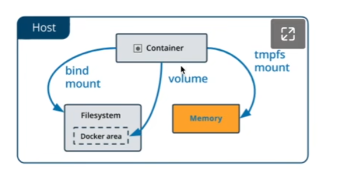
##### volumn卷
- **卷**存储在主机文件系统分配一块专有存储区域，由 Docker (在 Linux 上)管理，并且与主机的核心功能隔离。非 Docker 进程不能修改文件系统的这一部分。卷是在 Docker 中持久保存数据的最佳方式
##### bind mount绑定挂载
- **绑定挂载**可以将主机文件系统上目录或文件装载到容器中，但是主机上的非 Docker 进程可以修改它们，同时在容器中也可以更改主机文件系统，包括创建、修改或删除文件或目录，使用不当，可能会带来安全隐患。
##### tmpfs 临时挂载
- **tmpfs挂载**仅存储在主机系统的内存中，从不写入主机系统的文件系统。当容器停止时数据将被删除。

##### 绑定挂载(bind mount)
- 绑定挂载适用以下场景:
- 将配置文件从主机共享到容器
- 在Docker主机上的开发环境和容器之间共享源代码或编译目录
- 例如，可以将 Maven 的 **target/**目录挂载到容器中，每次在主机上用 Maven打包项目时，容器内- 都可以使用新编译的程序包。
###### -v参数
- 绑定挂载将主机上的目录或者文件装载到容器中。绑定挂载会覆盖容器中的目录或文件。如果宿主机目录不存在，docker会自动创建这个目录。但是docker只自动创建文件夹，不会创建文件。
- 例如，容器内mysql的配置文件和数据存储目录使用主机的目录。可以将配置文件设置为只读(read-only)防止容器更改主机中的文件。(在容器内不能编辑，在宿主机上可以修改)
- ```docker run -e MYSQL_ROOT_PASSWORD=123456 \```
- ```-v /home/mysql/mysql.cnf:/etc/mysql/conf.d/mysql.cnf:ro \``` //:前面是宿主机目录，:后面是容器目录
- ```-v /home/mysql/data:/var/lib/mysql \```
- ```-d mysql:5.7 ```
- 在宿主机上home目录下创建mysql文件夹
- 在其创建mysql配置文件mysql.cnf

##### volume 卷
- 卷是docker 容器存储数据的首选方式，卷有以下优势:
- 卷可以在多个正在运行的容器之间共享数据。仅当显式删除卷时，才会删除卷
- 当你想要将容器数据存储在外部网络存储上或云提供商上，而不是本地时。
- 当您需要备份、还原数据或将数据从一个 Docker 主机迁移到另卷更容易备份或迁移，一个 Docker 主机时，卷是更好的选择。
- ```docker create volume vol-my-data```
- ```docker run --name some-mysql-vol -e MYSQL_ROOT_PASSWORD=123456 \```
- ```-v /home/mysql/vol-my-data :/etc/mysql/conf.d/mysql.cnf:ro \``` 
- ```-v /home/mysql/vol-my-data:/var/lib/mysql \```
- ```-d mysql:5.7 ```
- ```docker inspect vol-my-data``` //查看卷


##### --tmpfs 临时挂载
- 临时挂载将数据保留在主机内存中，当容器停止时，文件将被删除
- ```docker run -d -it --tmpfs /tmp nginx:1.22-alpine```

### 部署应用
- 本例子我们使用docker来部署一个应用系统，RuoYi是一款用iava编写的，基于SpringBoot+Bootstrap的后台管理系统。
- ruoyi官方文档: http://doc.ruoyi.vip/ruoyi/
- 源码下载: https://gitee.com/y_project/RuoYi/tree/v4.7.4/将源码编译打包成ruoyi-admin.jar文件，放到宿主机/home/app目录下，/home/app/sql目录下是数据库初始化脚本。
- 配置文件中修改了端口、数据库连接信息。
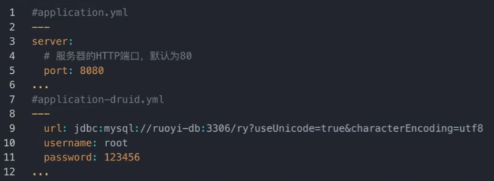
- 创建自定义网络 docker network create ruoyi-net
- 创建卷来存储数据 docker volume create  ruoyi-data

##### 我们在创建数据库容器的时候，需要做三件事:
- 创建数据库ry
- 设置字符集为utf-8
- 执行数据库初始化脚本
- 使用MYSQLDATABASE环境变量创建数据库设置字符集```--character-set-server=utf8mb4 --collation-server=utf8mb4_unicode_ci```
- 容器使用/docker-entrypoint-initdb.d目录下的脚本初始化数据库，脚本可以是.sh .sql和.sql.gz 这三种格式。
- ```docker run --name ruoyi-db \```
- ```-v ruoyi-data:/var/lib/mysql \```
- ```-v /home/app/sql:/docker-entrypoint-initdb.d \```
- ```-e MYSQL DATABASE=ry \ ```
- ```-e MYSQL ROOT_PASSWORD=123456 -d mysql:5.7 \```
- ```--character-set-server=utf8mb4 --collation-server=utf8mb4_unicode_ci```
- 连接自定义网络 ```docker network connect ruoyi-net ruoyi-db```
- 部署jar包，通过绑定挂载的方式加载到应用中
- 拉取镜像docker pull openjdk:8u342-jre

- ```docker run --name ruoyi-app \```
- ```-p 8080:8080 \```
- ```--network ruoyi-net \```
- ```-v /home/app/ruoyi-admin.jar:/usr/local/src/ruoyi-admin.jar \```
- ```-d openjdk:8u342-jre \```
- ```java -jar /usr/local/src/ruoyi-admin.jar ```

##### 运行之后，出现客户端访问乱码
- 1.修改运行参数
- 使用环境变量 LANG=C.UTF-8 设置客户端字符集
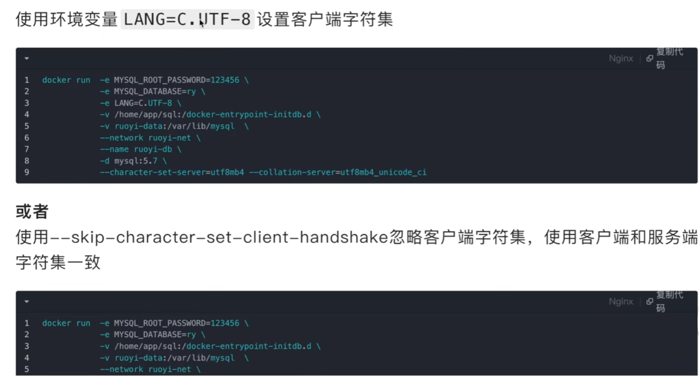
- 2.修改配置文件
- 修改/home/mysql/mysql.cnf
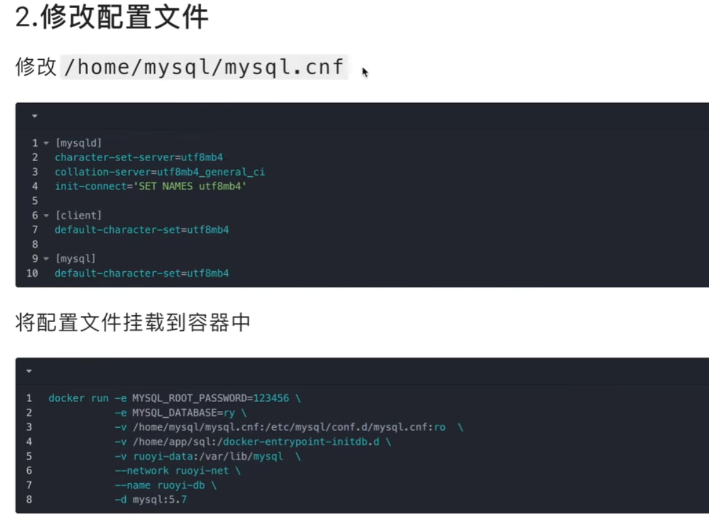

### docker compose 容器编排
- 在实际工作中，部署一个应用可能需要部署多个容器，一个一个部署非常不方便。docker compose可以一键部署和启动多个容器，它使用yaml文件来编排服务。github和docker hub很多项目都提供了docker-compose.yaml文件，我们可以一键部署项目，非常方便。

#### 一键部署wordpress
- wordpress是一个著名的开源博客系统
- 将以下内容保存到本地的```docker-compose.yml```文件中。
- ```docker compose``` 命令启动时，默认在当前目录下寻找 ```compose.yaml```或 ```compose.yml```，为了兼容之前的版本，也会查找 ```docker-compose.yaml```或 ```docker-compose.yml```。
- 也可以使用```-f```参数手动指定文件 ```docker compose -f docker-compose-dev.yml up -d```

- 在home目录下，创建wordpress
- 创建```docker-compose.yaml```文件 
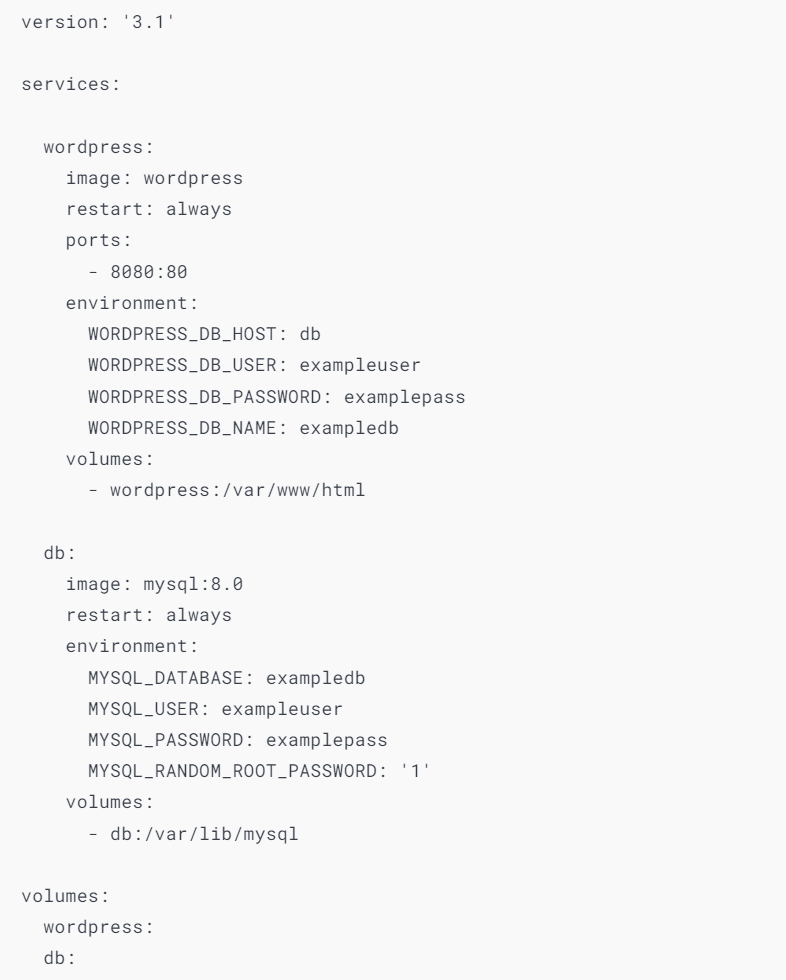
- ```docker compose up -d``` //一键部署
- ```docker compose stop``` 
- ``` docker logs -f``` 
- ``` docker compose start```
- ``` docker compose down``` //删除容器，和网络，不会删除卷
- ``` docker volume ls``` 
- ```docker compose up -d``` //在此启动，数据依然存在
- ```docker exec -it wordpress-wordpress-1 /bin/bash``` //方式1: 进入容器中执行命令
- ```docker compose exec -it wordpress /bin/bash``` //方式2: 进入容器中执行命令
- ```docker compose -p my up -d``` //改变前缀为my
