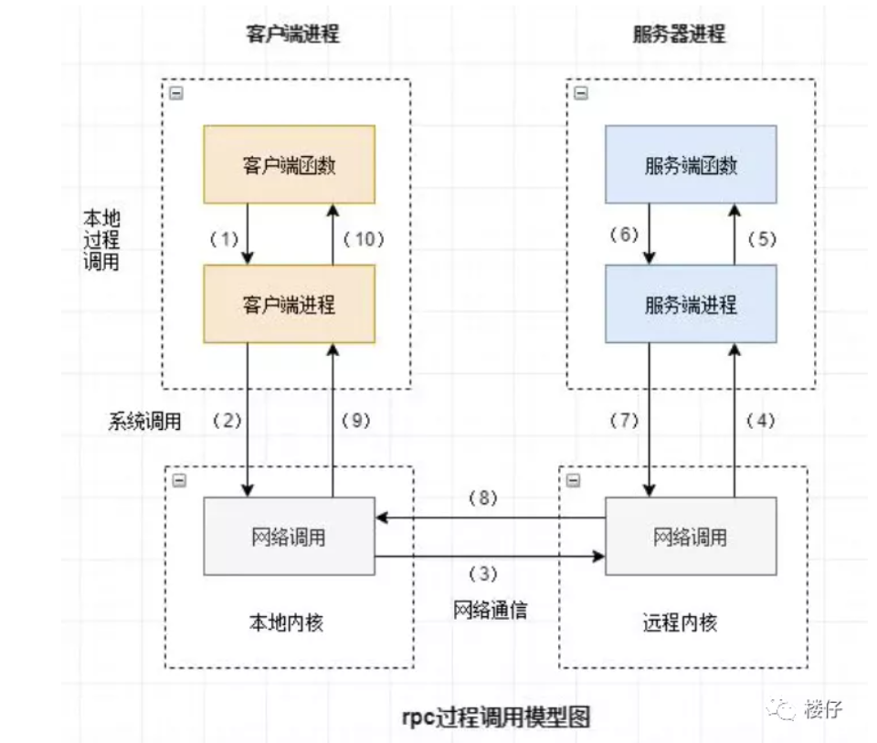
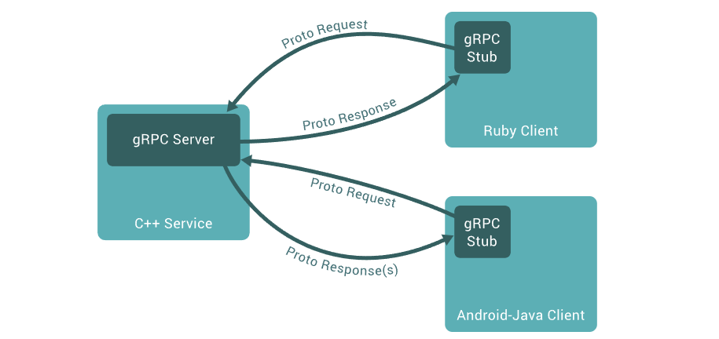
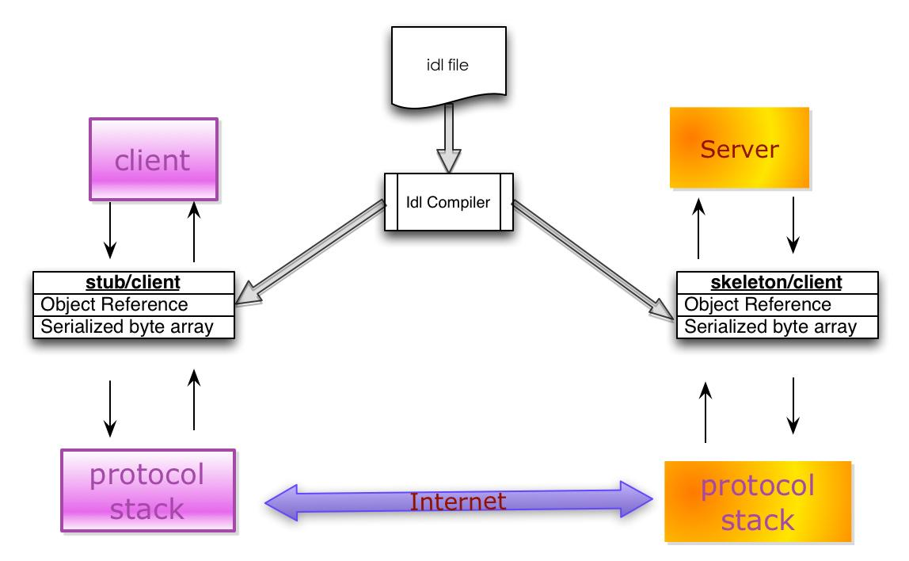

### grpc模块
- https://grpc.io/docs/languages/cpp/quickstart/

### rpc远程调用
- 客户端在不知道调用细节的情况下，调用存在于远程计算机上的某个对象，就像调用本地应用程序中的对象一样。
- 比较正式的描述是：一种通过网络从远程计算机程序上请求服务，而不需要了解底层网络技术的协议。
- 网络协议和网络IO模型对其透明：既然RPC的客户端认为自己是在调用本地对象。那么传输层使用的是TCP/UDP还是HTTP协议，又或者是一些其他的网络协议它就不需要关心了。


### 什么是gRPC
https://github.com/grpc/grpc
- gRPC 是一种现代、开源、高性能的远程过程调用 (RPC) 框架，基于 HTTP2 协议设计，可以在任何地方运行。gRPC 使客户端和服务器应用程序能够透明地通信，并简化连接系统的构建。
- 在 gRPC 中，客户端应用程序可以像本地对象一样直接调用不同机器上的服务器应用程序上的方法，从而使您可以更轻松地创建分布式应用程序和服务。与许多 RPC 系统一样，gRPC 基于定义服务的思想，指定可以远程调用的方法及其参数和返回类型。在服务器端，服务器实现这个接口并运行一个gRPC服务器来处理客户端调用。在客户端，客户端有一个存根（在某些语言中简称为客户端），它提供与服务器相同的方法。

- gRPC 客户端和服务器可以在各种环境中运行并相互通信（从 Google 内部的服务器到您自己的桌面），并且可以用 gRPC 支持的任何语言编写。例如，您可以使用 Java 轻松创建 gRPC 服务器，并使用 Go、Python 或 Ruby 编写客户端。此外，最新的 Google API 将具有其接口的 gRPC 版本，让您可以轻松地将 Google 功能构建到您的应用程序中。
### gRPC cpp 知识点
- https://grpc.io/docs/languages/cpp/quickstart/
### protobuf使用

##### 默认情况下，gRPC 使用Protocol Buffers，Google 成熟的开源机制，用于序列化结构化数据（尽管它可以与 JSON 等其他数据格式一起使用）
- 使用协议缓冲区时的第一步是定义要在原始文件中序列化的数据的结构：这是一个带有.proto扩展名的普通文本文件。Protocol buffer 数据被构造为 消息，其中每条消息都是一个小的逻辑信息记录，其中包含一系列称为字段的名称-值对。这是一个简单的例子：
```
message Person {
  string name = 1;
  int32 id = 2;
  bool has_ponycopter = 3;
}
```
- 然后，一旦指定了数据结构，您就可以使用协议缓冲区编译器protoc根据原型定义以您的首选语言生成数据访问类。它们为每个字段提供了简单的访问器，例如name()和set_name()，以及将整个结构序列化为原始字节或从原始字节解析整个结构的方法。因此，例如，如果您选择的语言是 C++，则在上面的示例上运行编译器将生成一个名为 的类Person。然后，您可以在应用程序中使用此类来填充、序列化和检索Person协议缓冲区消息。
- 可以在普通的 proto 文件中定义 gRPC 服务，并将 RPC 方法参数和返回类型指定为协议缓冲区消息：
```
// The greeter service definition.
service Greeter {
  // Sends a greeting
  rpc SayHello (HelloRequest) returns (HelloReply) {}
}

// The request message containing the user's name.
message HelloRequest {
  string name = 1;
}

// The response message containing the greetings
message HelloReply {
  string message = 1;
}
```
- gRPC 使用protoc特殊的 gRPC 插件从原始文件生成代码：您将获得生成的 gRPC 客户端和服务器代码，以及用于填充、序列化和检索消息类型的常规协议缓冲区代码。要了解有关protocol buffers的更多信息，包括如何protoc使用您选择的语言安装gRPC插件，请参阅protocol buffers文档
### 简要步骤
从文件中的服务定义开始.proto，gRPC 提供了用于生成客户端和服务器端代码的协议缓冲区编译器插件。gRPC 用户通常在客户端调用这些 API，并在服务器端实现相应的 API。
- 在服务器端，服务器实现服务声明的方法并运行 gRPC 服务器来处理客户端调用。gRPC 基础设施解码传入请求、执行服务方法并对服务响应进行编码。
- 在客户端，客户端有一个称为**存根（stub）**的本地对象，它实现与服务相同的方法。然后，客户端可以在本地对象上调用这些方法，并且这些方法将调用的参数包装在适当的协议缓冲区消息类型中，将请求发送到服务器，并返回服务器的协议缓冲区响应。

