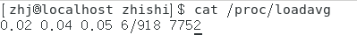
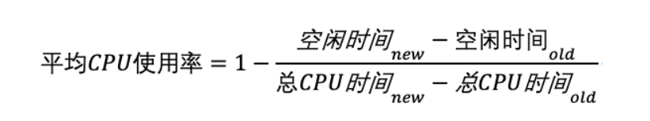
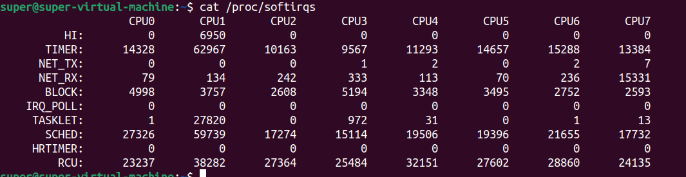
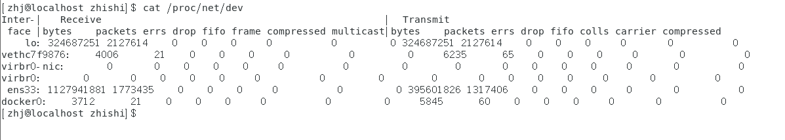

## monitor 监控模块 
- https://time.geekbang.org/column/article/84003

在GUN/Linux操作系统中，/proc是一个位于内存中的**伪文件系统(in-memory pseudo-file system)**。该目录下保存的不是真正的文件和目录，而是一些“运行时”信息，如系统内存、磁盘io、设备挂载信息和硬件配置信息等。proc目录是一个控制中心，用户可以通过更改其中某些文件来改变内核的运行状态。proc目录也是内核提供给我们的查询中心，我们可以通过这些文件查看有关系统硬件及当前正在运行进程的信息。在Linux系统中，许多工具的数据来源正是proc目录中的内容。
例如，top命令是通过 /proc/stat中数据，进行换算得出。
### cpu load
- /proc/loadavg 保存了系统负载的平均值，其前三列分别表示最近1分钟、5分钟及15分的平均负载。反映了当前系统的繁忙情况。如下：

#### 文件每列内容
```
- lavg_1 (4.61) 1-分钟平均负载
- lavg_5 (4.36) 5-分钟平均负载
- lavg_15(4.15) 15-分钟平均负载
- nr_running (9) 在采样时刻，运行队列的任务的数目，与/proc/stat的procs_running表示相同意思
- nr_threads (84) 在采样时刻，系统中活跃的任务的个数（不包括运行已经结束的任务）
- last_pid(5662) 最大的pid值，包括轻量级进程，即线程。
```
#### 平均负载
- 平均负载是指单位时间内，系统处于**可运行状态**和**不可中断状态**的平均进程数，也就是平均活跃进程数，它和 CPU 使用率并没有直接关系。
- 举例:
比如当平均负载为 2 时，意味着什么呢？
在只有 2 个 CPU 的系统上，意味着所有的 CPU 都刚好被完全占用。
在 4 个 CPU 的系统上，意味着 CPU 有 50% 的空闲。
而在只有 1 个 CPU 的系统中，则意味着有一半的进程竞争不到 CPU。
#### 平均负载为多少时合理
- 平均负载最理想的情况是等于 CPU 个数。
- 所以在评判平均负载时，首先你要知道系统有几个 CPU，这可以通过 top 命令或者从文件 /proc/cpuinfo 中读取CPU 个数，我们就可以判断出，当平均负载比 CPU 个数还大的时候，系统已经出现了过载。
#### 平均负载如何参考
不过，新的问题又来了。我们在例子中可以看到，平均负载有三个数值，到底该参考哪一个呢？
实际上，都要看。
**三个不同时间间隔的平均值，其实给我们提供了，分析系统负载趋势的数据来源，让我们能更全面、更立体地理解目前的负载状况。**
打个比方，就像初秋时北京的天气，如果只看中午的温度，你可能以为还在 7 月份的大夏天呢。
但如果你结合了早上、中午、晚上三个时间点的温度来看，基本就可以全方位了解这一天的天气情况了。
同样的，前面说到的 CPU 的三个负载时间段也是这个道理。如果 1 分钟、5 分钟、15 分钟的三个值基本相同，或者相差不大，那就说明系统负载很平稳。
但如果 1 分钟的值远小于 15 分钟的值，就说明系统最近 1 分钟的负载在减少，而过去 15 分钟内却有很大的负载。
反过来，如果 1 分钟的值远大于 15 分钟的值，就说明最近 1 分钟的负载在增加，这种增加有可能只是临时性的，也有可能还会持续增加下去，所以就需要持续观察。
一旦 1 分钟的平均负载接近或超过了 CPU 的个数，就意味着系统正在发生过载的问题，这时就得分析调查是哪里导致的问题，并要想办法优化了。
这里我再举个例子，假设我们在一个单 CPU 系统上看到平均负载为 1.73，0.60，7.98，那么说明在过去 1 分钟内，系统有 73% 的超载，而在 15 分钟内，有 698% 的超载，从整体趋势来看，系统的负载在降低。
那么，在实际生产环境中，平均负载多高时，需要我们重点关注呢？在我看来，当平均负载高于 CPU 数量 70% 的时候，你就应该分析排查负载高的问题了。
一旦负载过高，就可能导致进程响应变慢，进而影响服务的正常功能。但 70% 这个数字并不是绝对的，最推荐的方法，还是把系统的平均负载监控起来，然后根据更多的历史数据，判断负载的变化趋势。当发现负载有明显升高趋势时，比如说负载翻倍了，你再去做分析和调查。

#### 平均负载与 CPU 使用率
- 现实工作中，我们经常容易把平均负载和 CPU 使用率混淆，所以在这里，我也做一个区分。可能你会疑惑，既然平均负载代表的是活跃进程数，那平均负载高了，不就意味着 CPU 使用率高吗？
我们还是要回到平均负载的含义上来，**平均负载是指单位时间内，处于可运行状态和不可中断状态的进程数。**
所以，它不仅包括了正在使用 CPU 的进程，还包括等待 CPU 和等待 I/O 的进程。
而 CPU 使用率，是单位时间内 CPU 繁忙情况的统计，跟平均负载并不一定完全对应。
比如：CPU 密集型进程，使用大量 CPU 会导致平均负载升高，此时这两者是一致的；
I/O 密集型进程，等待 I/O 也会导致平均负载升高，但 CPU 使用率不一定很高；
大量等待 CPU 的进程调度也会导致平均负载升高，此时的 CPU 使用率也会比较高。

#### 总结
- 平均负载提供了一个快速查看系统整体性能的手段，反映了整体的负载情况。
- 但只看平均负载本身，我们并不能直接发现，到底是哪里出现了瓶颈。
- 所以，在理解平均负载时，也要注意：
- 平均负载高有可能是 CPU 密集型进程导致的；
- **平均负载高并不一定代表 CPU 使用率高，还有可能是 I/O 更繁忙了**；
### cpu stat
- Linux 通过 /proc 虚拟文件系统，向用户空间提供了系统内部状态的信息，而 /proc/stat 提供的就是**系统的 CPU 和任务统计信息**。
- 当然，这里每一列的顺序并不需要你背下来。你只要记住，有需要的时候，查询 man proc 就可以。
#### 文件每列内容
- 不过，你要清楚 man proc 文档里每一列的涵义，它们都是 CPU 使用率相关的重要指标，你还会在很多其他的性能工具中看到它们。
```
- user（通常缩写为 us），代表用户态 CPU 时间。注意，它不包括下面的 nice 时间，但包括了 guest 时间。
- nice（通常缩写为 ni），代表低优先级用户态 CPU 时间，也就是进程的 nice 值被调整为 1-19 之间时的 CPU 时间。这里注意，nice 可取值范围是 -20 到 19，数值越大，优先级反而越低。
- system（通常缩写为 sys），代表内核态 CPU 时间。
- idle（通常缩写为 id），代表空闲时间。注意，它不包括等待 I/O 的时间（iowait）。
- iowait（通常缩写为 wa），代表等待 I/O 的 CPU 时间。
- irq（通常缩写为 hi），代表处理硬中断的 CPU 时间。
- softirq（通常缩写为 si），代表处理软中断的 CPU 时间。
- steal（通常缩写为 st），代表当系统运行在虚拟机中的时候，被其他虚拟机占用的 CPU 时间。
- guest（通常缩写为 guest），代表通过虚拟化运行其他操作系统的时间，也就是运行虚拟机的 CPU 时间。
- guest_nice（通常缩写为 gnice），代表以低优先级运行虚拟机的时间。
```
#### cpu使用率

事实上，为了计算 CPU 使用率，性能工具一般都会取间隔一段时间（比如 3 秒）的两次值，作差后，再计算出这段时间内的平均 CPU 使用率

### cpu softirqs
- /proc/softirqs 记录自开机以来软中断累积次数
- /proc/interrupts 记录自开机以来的累积中断次数
#### 文件每列内容

```
TIMER（定时中断）
NET_TX(网络发送)
NET_RX（网络接收）
SCHED（内核调度）
RCU（RCU 锁）中，网络接收变化最快
```
#### 中断
##### 概念
- 比如说你订了一份外卖，但是不确定外卖什么时候送到，也没有别的方法了解外卖的进度，但是，配送员送外卖是不等人的，到了你这儿没人取的话，就直接走人了。
所以你只能苦苦等着，时不时去门口看看外卖送到没，而不能干其他事情。
不过呢，如果在订外卖的时候，你就跟配送员约定好，让他送到后给你打个电话，那你就不用苦苦等待了，就可以去忙别的事情，直到电话一响，接电话、取外卖就可以了。
这里的“打电话”，其实就是一个中断。没接到电话的时候，你可以做其他的事情；只有接到了电话（也就是发生中断），你才要进行另一个动作：取外卖。
##### 中断其实是一种异步的事件处理机制，可以提高系统的并发处理能力
##### 中断运行时间
由于中断处理程序会打断其他进程的运行，所以，为了减少对正常进程运行调度的影响，中断处理程序就需要尽可能快地运行。
如果中断本身要做的事情不多，那么处理起来也不会有太大问题；
但如果中断要处理的事情很多，中断服务程序就有可能要运行很长时间。
##### 特别是，中断处理程序在响应中断时，还会临时关闭中断。这就会导致上一次中断处理完成之前，其他中断都不能响应，也就是说中断有可能会丢失。
那么还是以取外卖为例。假如你订了 2 份外卖，一份主食和一份饮料，并且是由 2 个不同的配送员来配送。这次你不用时时等待着，两份外卖都约定了电话取外卖的方式。但是，问题又来了。接第1份外卖的时候，第2份外卖来了，但是打不通你的电话。
##### 软中断
如果你弄清楚了“取外卖”的模式，那对系统的中断机制就很容易理解了。
事实上，为了解决中断处理程序执行过长和中断丢失的问题，Linux 将中断处理过程分成了两个阶段，也就是上半部和下半部：
- 上半部用来快速处理中断，它在中断禁止模式下运行，主要处理跟硬件紧密相关的或时间敏感的工作。
- 下半部用来延迟处理上半部未完成的工作，通常以内核线程的方式运行。
比如说前面取外卖的例子，上半部就是你接听电话，告诉配送员你已经知道了，其他事儿见面再说，然后电话就可以挂断了；下半部才是取外卖的动作，以及见面后商量发票处理的动作。
这样，第一个配送员不会占用你太多时间，当第二个配送员过来时，照样能正常打通你的电话。
除了取外卖，我再举个最常见的网卡接收数据包的例子，让你更好地理解。网卡接收到数据包后，会通过硬件中断的方式，通知内核有新的数据到了。
这时，内核就应该调用中断处理程序来响应它。你可以自己先想一下，这种情况下的上半部和下半部分别负责什么工作呢？
- 对上半部来说，既然是快速处理，其实就是要把网卡的数据读到内存中，然后更新一下硬件寄存器的状态（表示数据已经读好了），最后再发送一个软中断信号，通知下半部做进一步的处理。
- 而下半部被软中断信号唤醒后，需要从内存中找到网络数据，再按照网络协议栈，
对数据进行逐层解析和处理，直到把它送给应用程序。
所以，这两个阶段你也可以这样理解：
- 上半部直接处理硬件请求，也就是我们常说的硬中断，特点是快速执行；
- 而下半部则是由内核触发，也就是我们常说的软中断，特点是延迟执行。
实际上，上半部会打断 CPU 正在执行的任务，然后立即执行中断处理程序。
而下半部以内核线程的方式执行，并且每个 CPU 都对应一个软中断内核线程，名字为 “ksoftirqd/CPU 编号”，
比如说， 0 号 CPU 对应的软中断内核线程的名字就是 ksoftirqd/0。不过要注意的是，软中断不只包括了刚刚所讲的硬件设备中断处理程序的下半部，一些内核自定义的事件也属于软中断，
比如内核调度和 RCU 锁（Read-Copy Update 的缩写，RCU 是 Linux 内核中最常用的锁之一）等。
**RCU的使用场景是读多写少的场景，但是他和读写锁最大的差异就是，读写锁在持有写锁的时候，读锁会被阻塞，但是RCU允许读锁高并发，就算在持有写锁的时候，也能实现读锁不被阻塞。RCU经常和链表的场景结合在一起。**

要注意同一种软中断在不同 CPU 上的分布情况，也就是同一行的内容。正常情况下，同一种中断在不同 CPU 上的累积次数应该差不多。比如这个界面中，NET_RX 在 CPU0 和 CPU1 上的中断次数基本是同一个数量级，相差不大。
##### 总结
Linux 中的中断处理程序分为上半部和下半部：
- 上半部对应硬件中断，用来快速处理中断。
- 下半部对应软中断，用来异步处理上半部未完成的工作。
- Linux 中的软中断包括网络收发、定时、调度、RCU锁等各种类型，可以通过查看 /proc/softirqs 来观察软中断的运行情况。
### mem info
/proc/meminfo 当前内存使用的统计信息，常由free命令使用；可以使用文件查看命令直接读取此文件，其内容显示为两列，前者为统计属性，后者为对应的值。
```
MemTotal: 所有内存(RAM)大小,减去一些预留空间和内核的大小。
MemFree: 完全没有用到的物理内存，lowFree+highFree
MemAvailable: 在不使用交换空间的情况下，启动一个新的应用最大可用内存的大小，计算方式：MemFree+Active(file)+Inactive(file)-(watermark+min(watermark,Active(file)+Inactive(file)/2))
Buffers: 块设备所占用的缓存页，包括：直接读写块设备以及文件系统元数据(metadata)，比如superblock使用的缓存页。
Cached: 表示普通文件数据所占用的缓存页。
SwapCached: swap cache中包含的是被确定要swapping换页，但是尚未写入物理交换区的匿名内存页。那些匿名内存页，比如用户进程malloc申请的内存页是没有关联任何文件的，如果发生swapping换页，这类内存会被写入到交换区。
Active: active包含active anon和active file
Inactive: inactive包含inactive anon和inactive file
Active(anon): anonymous pages（匿名页），用户进程的内存页分为两种：与文件关联的内存页(比如程序文件,数据文件对应的内存页)和与内存无关的内存页（比如进程的堆栈，用malloc申请的内存），前者称为file pages或mapped pages,后者称为匿名页。
Inactive(anon): 见上
Active(file): 见上
Inactive(file): 见上
SwapTotal: 可用的swap空间的总的大小(swap分区在物理内存不够的情况下，把硬盘空间的一部分释放出来，以供当前程序使用)
SwapFree: 当前剩余的swap的大小
Dirty: 需要写入磁盘的内存去的大小
Writeback: 正在被写回的内存区的大小
AnonPages: 未映射页的内存的大小
Mapped: 设备和文件等映射的大小
Slab: 内核数据结构slab的大小
SReclaimable: 可回收的slab的大小
SUnreclaim: 不可回收的slab的大小
PageTables: 管理内存页页面的大小
NFS_Unstable: 不稳定页表的大小
VmallocTotal: Vmalloc内存区的大小
VmallocUsed: 已用Vmalloc内存区的大小
VmallocChunk: vmalloc区可用的连续最大快的大小
```

#### 内存使用率
##### free
- 第一列，total 是总内存大小；
- 第二列，used 是已使用内存的大小，包含了共享内存；
- 第三列，free 是未使用内存的大小；
- 第四列，shared 是共享内存的大小；
- 第五列，buff/cache 是缓存和缓冲区的大小；
- 最后一列，available 是新进程可用内存的大小。
这里尤其注意一下，最后一列的可用内存 available 。available 不仅包含未使用内存，还包括了可回收的缓存，所以一般会比未使用内存更大。不过，并不是所有缓存都可以回收，因为有些缓存可能正在使用中。
##### buffer和cache
- Buffers 是对原始磁盘块的临时存储，也就是用来缓存磁盘的数据，通常不会特别大（20MB 左右）。这样，内核就可以把分散的写集中起来，统一优化磁盘的写入，比如可以把多次小的写合并成单次大的写等等。
- Cached 是从磁盘读取文件的页缓存，也就是用来缓存从文件读取的数据。这样，下次访问这些文件数据时，就可以直接从内存中快速获取，而不需要再次访问缓慢的磁盘。
- Buffer 是对磁盘数据的缓存，而 Cache 是文件数据的缓存，它们既会用在读请求中，也会用在写请求中。
### net
/proc/net/dev 网络流入流出的统计信息，包括接收包的数量、发送包的数量，发送数据包时的错误和冲突情况等。

```
bytes: （接口发送或接收的数据的总字节数）
packets: （接口发送或接收的数据包总数）
errs:（由设备驱动程序检测到的发送或接收错误的总数）
drop: （设备驱动程序丢弃的数据包总数）
fifo: （FIFO缓冲区错误的数量）
frame: T（分组帧错误的数量）
colls: （接口上检测到的冲突数）
compressed:（设备驱动程序发送或接收的压缩数据包数）
carrier: （由设备驱动程序检测到的载波损耗的数量）
multicast: （设备驱动程序发送或接收的多播帧数）
```

### stress压测指令
- https://www.cnblogs.com/sparkdev/p/10354947.html

- 基本语法
- 语法格式：
- stress
- 常用选项：
```
-c, --cpu N 产生 N 个进程，每个进程都反复不停的计算随机数的平方根
-i, --io N 产生 N 个进程，每个进程反复调用 sync() 将内存上的内容写到硬盘上
-m, --vm N 产生 N 个进程，每个进程不断分配和释放内存
--vm-bytes B 指定分配内存的大小
--vm-stride B 不断的给部分内存赋值，让 COW(Copy On Write)发生
--vm-hang N 指示每个消耗内存的进程在分配到内存后转入睡眠状态 N 秒，然后释放内存，一直重复执行这个过程
--vm-keep 一直占用内存，区别于不断的释放和重新分配(默认是不断释放并重新分配内存)
-d, --hadd N 产生 N 个不断执行 write 和 unlink 函数的进程(创建文件，写入内容，删除文件)
--hadd-bytes B 指定文件大小
-t, --timeout N 在 N 秒后结束程序
--backoff N 等待N微妙后开始运行
-q, --quiet 程序在运行的过程中不输出信息
-n, --dry-run 输出程序会做什么而并不实际执行相关的操作
--version 显示版本号
-v, --verbose 显示详细的信息
```
```
sudo apt install stress
```