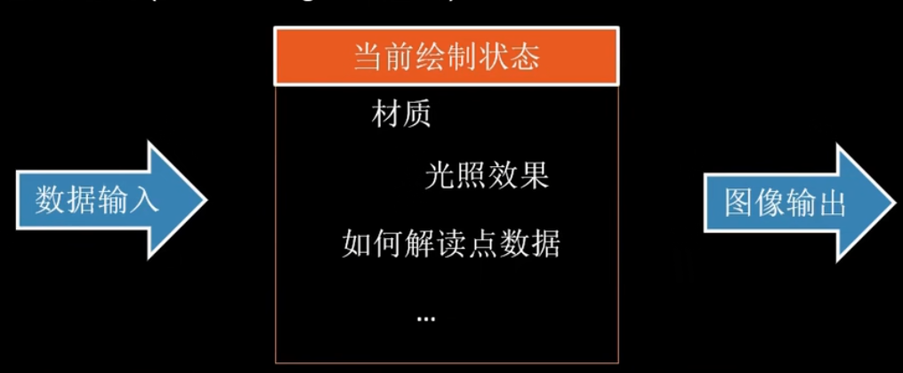
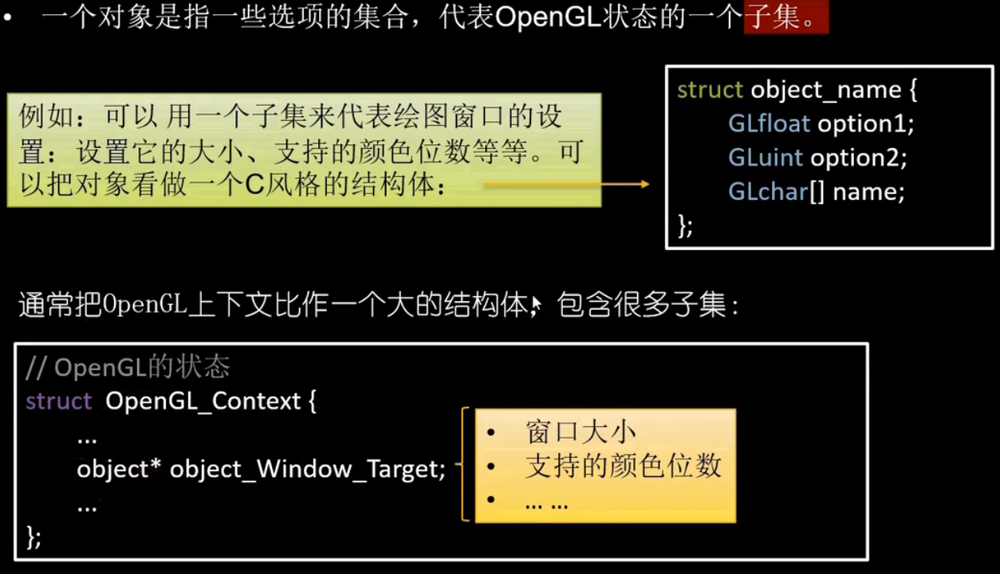
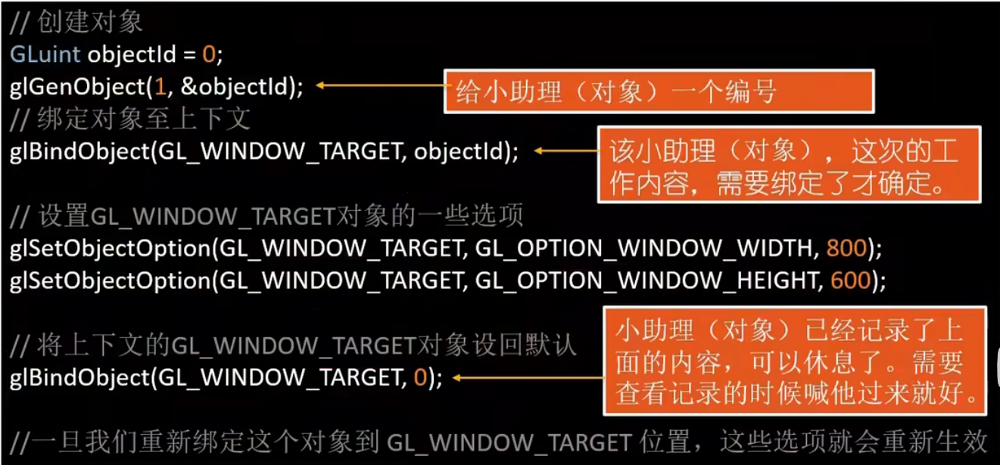

- https://www.bilibili.com/video/BV1GS4y117pX/?spm_id_from=333.999.0.0&vd_source=20fefbe660011b266b8ae8644f72ffe9
### 状态机(State Machine)
- OpenGL自身是一个巨大的状态机
- 变量(描述该如何操作) 的大集合
- OpenGL的状态通常被称为**上下文(Context)**
- 状态设置函数(State-changing Function)
- 状态应用的函数(State-using Function)

### 对象
- 一个对象是指一些选项的集合，代表OpenGL状态的一个子集。
- 例如: 可以用一个子集来代表绘图窗口的设置: 设置它的大小、支持的颜色位数等等。可以把对象看做一个C风格的结构体:

### 状态机、上下文、对象
- 