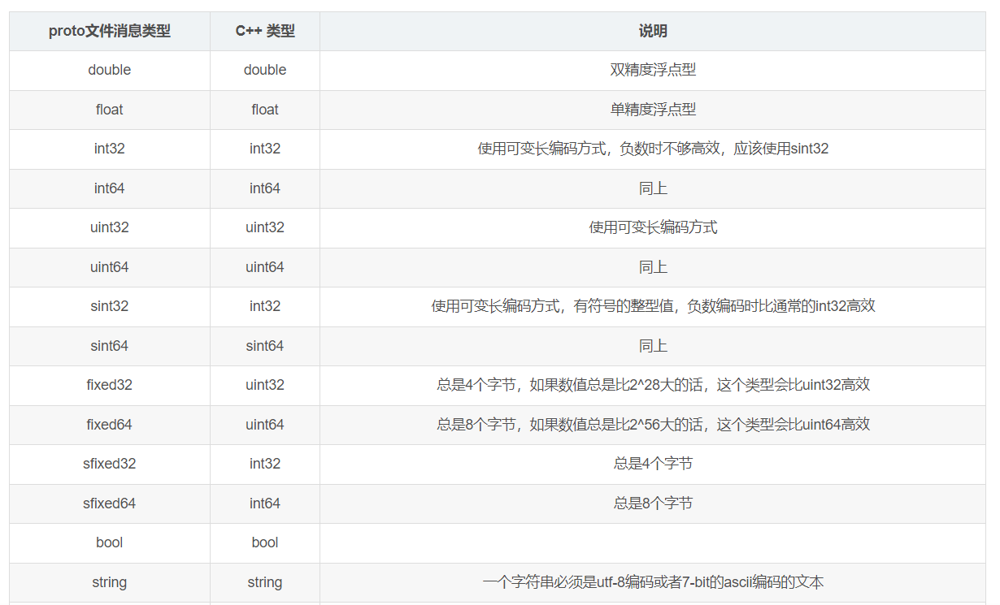

## protobuf

### protobuf基础知识
#### protobuf
- 二进制编码，传输较快，易于扩展；
- 不需要存储多余的信息；
#### json
- 文本格式
- 需要存储其他信息，key，value

#### proto数据类型

#### protoBuf 使用一般步骤
- 第一步：定义 proto 文件，文件的内容就是定义我们需要存储或者传输的数据结构，也就是定义我们自己的数据存储或者传输的协议。
- 第二步：使用 ProtoBuf 编译器 protoc 来编译自定义的 proto 文件，用于生成 .pb.h 文件（proto 文件中自定义类的头文件）和 .pb.cc（proto文件中自定义类的实现文件）。
- 第三步：使用 ProtoBuf 的 C++ API 来读写消息。
#### 定义proto文件
- test.proto
```
syntax = "proto3";
package monitor.proto;

message CpuLoad {
    float load_avg_1 = 1;
    float load_avg_3 = 2;
    float load_avg_15 = 3;
  }
  
message NetInfo {
    string name = 1;
    float send_rate = 2;
  }
  
 message MonitorInfo{
  CpuLoad cpu_load = 1; #std::string
  repeated NetInfo net_info = 2; # std::vector
}
```
- protoc编译器，编译test.proto
```
protoc -I$SRC_DIR --cpp_out=$DST_DIR test.proto
#private-node/proto
参数解释
-I$SRC_DIR 指定test.proto所在目录
--cpp_out=$DST_DIR 指定生成cpp相关文件，并指定生成路径
test.proto 需要编译的proto文件
```
- ProtoBuf 的 C++ API 来读写消息
- 序列化，反序列化API
```
bool SerializeToString(string* output) const; //将消息序列化并储存在指定的string中。注意里面的内容是二进制的，而不是文本；我们只是使用string作为一个很方便的容器。

bool ParseFromString(const string& data); //从给定的string解析消息。

bool SerializeToArray(void * data, int size) const        //将消息序列化至数组

bool ParseFromArray(const void * data, int size)        //从数组解析消息

bool SerializeToOstream(ostream* output) const; //将消息写入到给定的C++ ostream中。

bool ParseFromIstream(istream* input); //从给定的C++ istream解析消息。
```
```
syntax = "proto3";
package monitor.proto;

message CpuLoad {
    float load_avg_1 = 1;
    float load_avg_3 = 2;
    float load_avg_15 = 3;
  }
  
message NetInfo {
    string name = 1;
    float send_rate = 2;
  }
  
 message MonitorInfo{
  std::string happly = 1;
  CpuLoad cpu_load = 2; #std::string
  repeated NetInfo net_info = 3; # std::vector
}


monitor::proto::MonitorInfo monitor_info;
monitor_info.set_happly("1111");

::monitor::proto::CpuLoad* cpu_load_msg = monitor_info.mutable_cpu_load();
cpu_load_msg->set_load_avg_1(1.2);
cpu_load_msg->set_load_avg_3(1.4);
cpu_load_msg->set_load_avg_15(1.8);

::monitor::proto::NetInfo*  net_info_msg1  = monitor_info.add_net_info();
net_info_msg1->set_name("super-1");
net_info_msg1->set_send_rate(12.5);

auto net_info_msg2  = monitor_info.add_net_info();
net_info_msg2->set_name("super-2");
net_info_msg2->set_send_rate(8.5);

 // 对消息对象MonitorInfo序列化到string容器
std::string serializedStr;
monitor_info.SerializeToString(&serializedStr);
std::cout<<"serialization result:"<<serializedStr<<std::endl; //序列化后的字符串内容是二进制内容，非可打印字符，预计输出乱码


//反序列化
monitor::proto::MonitorInfo monitor_info;
monitor_info.ParseFromString(serializedStr)；
    
std::cout << monitor_info.happly()<<std::endl;


message CpuLoad {
    float load_avg_1 = 1;
    float load_avg_3 = 2;
    float load_avg_15 = 3;
  }
  
auto cpu_load_parse =  monitor_info.cpu_load();
std::cout << cpu_load_parse.load_avg_1()<< cpu_load_parse.load_avg_3()<<std::endl;


for (int i = 0; i < monitor_info.net_info_size(); i++) {
        std::cout <<monitor_info.net_info(i).name();
         std::cout << monitor_info.net_info(i).send_rate();
}
```